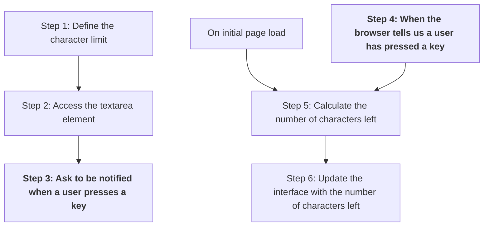

+++
title = 'Check progress'

time = 15
hide_from_overview = true
[objectives]
    1='Use a plan to check progress in solving a problem'
[build]
  render = 'never'
  list = 'local'
  publishResources = false

+++

Let's use the plan from earlier to check our progress.



Let's consider our code at the moment:

```js
const textarea = document.querySelector("textarea");
const remainingCharacters = textarea.maxLength - textarea.value.length;

const charactersLeftP = document.querySelector("#character-limit-info");
charactersLeftP.innerText = `You have ${remainingCharacters} characters remaining`;

function updateCharacterLimit() {
  console.log(
    "keyup event has fired... The browser called updateCharacterLimit..."
  );
}

textarea.addEventListener("keyup", updateCharacterLimit);
```

We've done the following:

- [x] Step 1: Defined a `characterLimit`
- [x] Step 2: Accessed the `textarea` element
- [x] Step 3: Registered an event handler `updateCharacterLimit`
- [x] Step 5: Calculate the number of characters left
- [x] On initial page load, update the user interface with the number of characters left

The browser will do the following for us:

- [x] Step 4: The browser will tell us when a user has pressed a key

We must still complete the following steps:

- [ ] Step 6: Update the user interface with the number of characters left

We can re-use our existing code to update the user interface when the browser tells us the user has pressed a key:

```js
const textarea = document.querySelector("textarea");
const remainingCharacters = textarea.maxLength - textarea.value.length;

const charactersLeftP = document.querySelector("#character-limit-info");
charactersLeftP.innerText = `You have ${remainingCharacters} characters remaining`;

function updateCharacterLimit() {
  const remainingCharacters = textarea.maxLength - textarea.value.length;
  const charactersLeftP = document.querySelector("#character-limit-info");
  charactersLeftP.innerText = `You have ${remainingCharacters} characters remaining`;
}

textarea.addEventListener("keyup", updateCharacterLimit);
```

Typing in to the `textarea` element, we should see the page get updated to say e.g. "You have 118 characters left".
