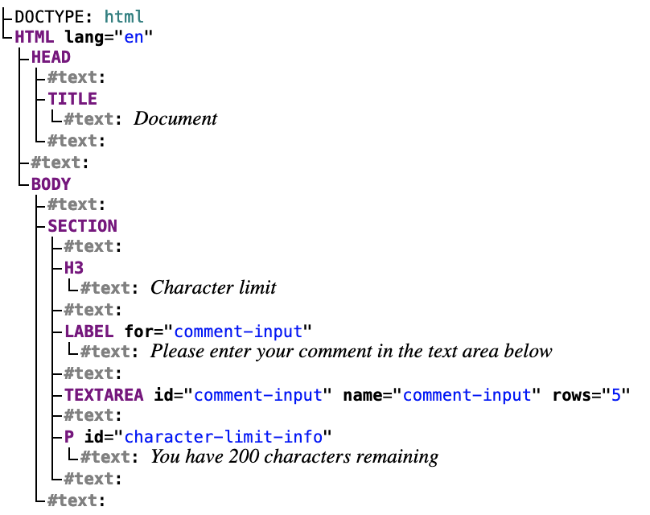

+++
title = 'The DOM'

time = 20
[objectives]
    1='Define the Document Object Model'
[build]
  render = 'never'
  list = 'local'
  publishResources = false

+++

Let's consider the starting HTML. We need a way of interacting with the elements of this page once it is rendered.

```html
<!DOCTYPE html>
<html lang="en">
  <head>
    <meta charset="UTF-8" />
    <meta name="viewport" content="width=device-width, initial-scale=1.0" />
    <title>Document</title>
  </head>
  <body>
    <section>
      <h3>Character limit</h3>
      <label for="comment-input">
        Please enter your comment in the text area below
      </label>
      <textarea
        id="comment-input"
        name="comment-input"
        rows="5"
        maxlength="200"
      ></textarea>
      <p id="character-limit-info">You have 200 characters remaining</p>
    </section>
  </body>
</html>
```

### 🌳 HTML tree

HTML documents form a [tree-like structure](https://en.wikipedia.org/wiki/Tree_structure). We start at the top `html` element and from there other html elements are nested inside.



When we use a web browser, it takes this HTML document, and provides us with an interface - a visual representation of the document, which we can read, and interact with (e.g. with a keyboard and mouse).

### Document Object Model

When the browser first renders a web page it also creates the DOM - short for The **D**ocument **O**bject **M**odel is a data representation of the content in a web page. All HTML elements are represented as objects that can be accessed, modified and deleted..

Just like a web browser provides us a visual interface, the DOM is an interface. But it is not an interface for humans to see and interact with, it is an interface for JavaScript to interact with. We can write JavaScript programs to interact with the Document Object Model so we can make the page interactive.

> [!TIP]
>
> ### 🔎 Inspect with dev tools
>
> We can use Dev Tools to inspect the DOM and look at the elements on the page. Use Dev Tools to inspect the character limit component from earlier.
