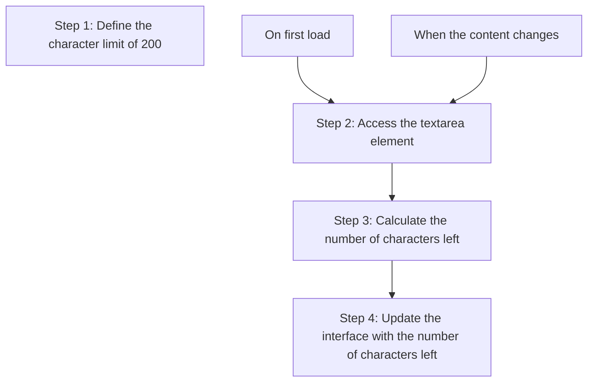
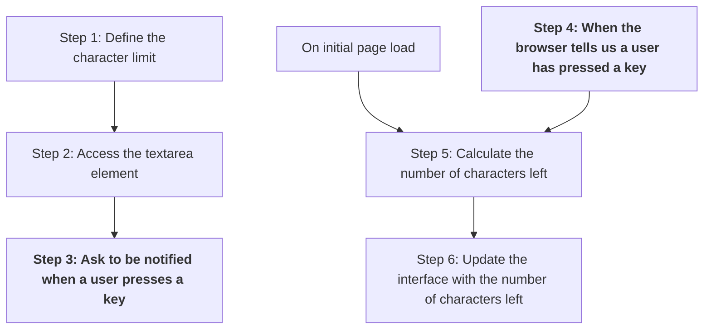

+++
title = 'DOM events'

time = 60
[objectives]
    1='Describe an event in the browser environment'
    2='Update the strategy for implementing a character limit component'
[build]
  render = 'never'
  list = 'local'
  publishResources = false

+++

In the case of the ` textarea` element, we want to update the `p` element text **every time the user types inside the textarea**. In other words, we want our application to **_react_** to the **_user typing on the keyboard_**. Currently our plan looks like this:

However, we're missing a step in our plan. We need to find a way of running some code in response to an **event**.


An [event](https://developer.mozilla.org/en-US/docs/Learn/JavaScript/Building_blocks/Events) is something that occurs in a programming environment that can be observed or responded to.


Events are things that happen in the browser, which your code can ask to be told about, so that your code can react to them. In a browser context, an event could be:

- a user clicking on a button
- a user typing something into a textarea box
- a user submitting a form
- and so on.

Not all events are in response to user actions. You can think of events as "interesting changes". For instance, there is an event for the browser completing its initial render of the page. You can find a [complete reference all the different event types](https://developer.mozilla.org/en-US/docs/Web/Events) on MDN.

When a user presses a key in our `textarea`, the browser will create an event. If we asked the browser to tell us about it, we can respond to it. So we can update our plan as follows:

Notice a few things here:

- There's no arrow between Step 3 and Step 4. The trigger for Step 4 is _a user doing something_. If the user doesn't type anything in the textarea, Step 4 will not run after the first load (and neither will Step 5 and Step 6).
- _We_ don't run Step 4. The _browser_ runs Step 4. In Step 3 we asked the browser to do something for us in the future. **This is something new.** Up until now, _we_ have always been the ones telling JavaScript what to do next.
