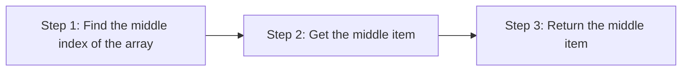

+++
title = 'Calculating the median'

time = 15
hide_from_overview = true
[objectives]
1='Describe how to calculate the median of a list in JavaScript' 
[build]
  render = 'never'
  list = 'local'
  publishResources = false

+++

Let's define another problem.

We want to _calculate_ the [median](https://www.bbc.co.uk/bitesize/guides/zwhgk2p/revision/2) value from an array of numbers.

_Given_ an array of numbers in _ascending order_  
_When_ we call `calculateMedian` with this array  
_Then_ we get the median value.

We calculate the median of a list of numbers by finding the middle value in the list.

Let's start with a test to check the **return value** of `calculateMedian` given an ordered list of numbers. In your `prep` dir, `touch median.js && touch median.test.js`. Write the following test in the `median.test.js` file.

```js
test("calculates the median of a list of odd length", () => {
  const list = [10, 20, 30, 50, 60];
  const currentOutput = calculateMedian(list);
  const targetOutput = 30;

  expect(currentOutput).toEqual(targetOutput);
});
```

### 🔨 Implementing `calculateMedian`

So we can implement `calculateMedian`.

We can summarise our approach as follows.



In code we can we can use [`splice`](https://developer.mozilla.org/en-US/docs/Web/JavaScript/Reference/Global_Objects/Array/splice) to to get the middle item.

```js
function calculateMedian(list) {
  const middleIndex = Math.floor(list.length / 2);
  const median = list.splice(middleIndex, 1)[0];

  return median;
}
```
