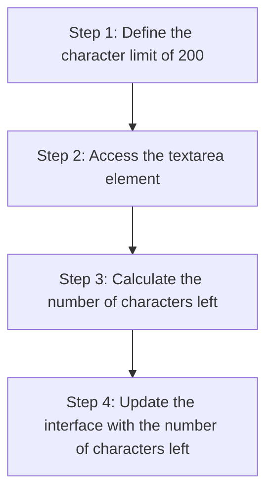
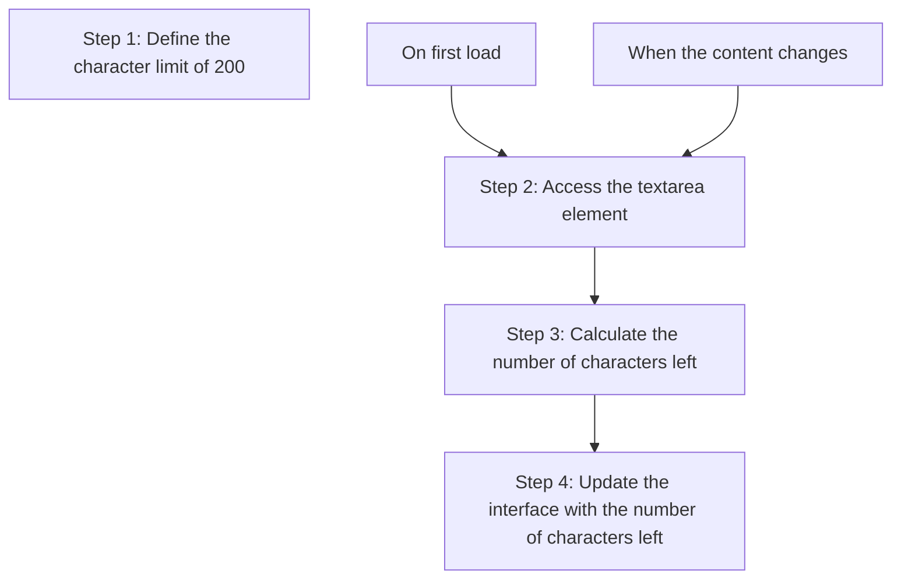

+++
title = 'Breaking down the strategy'

time = 20
hide_from_overview = true
[objectives]
    1='Break down a problem into a series of steps'
[build]
  render = 'never'
  list = 'local'
  publishResources = false

+++

To implement the character limit component, we need to update the interface as the user types in the text area. We can outline a strategy as follows:

There are two times we may want to do this:

1. When the page first loads we should show the _initial_ limit.
2. Whenever the user adds or removes a character from the textarea, we want to _update_ to show the remaining limit.

Steps 2-4 will be the same, whether we're doing this for the _initial_ load or a subsequent _update_.

This strategy gives us a rough guide for the road ahead. However, as we learn more about this problem, we may need to update our strategy.
