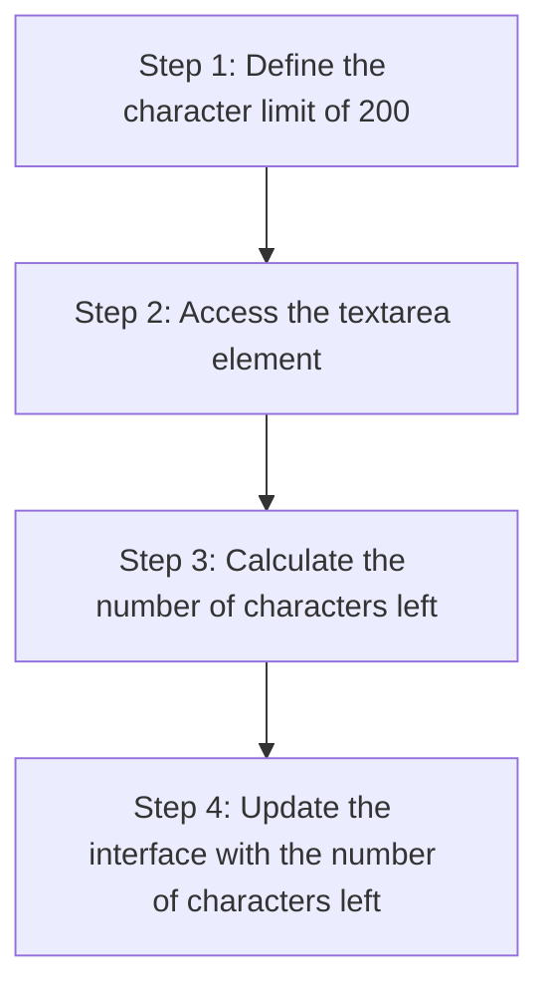

+++
title = '🧭 Strategy'
[build]
    render = false
    list = 'local'
    publishResources = false
time = 20
facilitation = false
emoji= '🧩'
[objectives]
    1='Break down a problem into a series of steps'
+++

To implement the character limit component, we need to update the interface as the user types in the text area. We can outline a strategy as follows:

This strategy gives us a rough guide for the road ahead. However, as we learn more about this problem, we may need to update our strategy.
