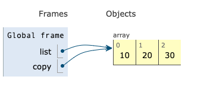

+++
title = 'References'

time = 20
[objectives]
    1='Define reference'
    2='Describe some effects of variables being assigned the same array reference'
    3='Identify when 2 variables will share the same array reference'
[build]
  render = 'never'
  list = 'local'
  publishResources = false

+++

Arrays are stored by 
A reference points to a location in memory.


Consider the following example,

```js
const list = [10, 20, 30];
const copy = list;
copy.push(60, 70);

console.log(list);
console.log(copy);
```

Let's break down what is happening in this program.



===[[🎮 Playing computer]]===

Play computer with the code above to step through the code and find out what happens when the code is executed.

<iframe title="playing-computer-reference "width="800" height="500" frameborder="0" src="https://pythontutor.com/iframe-embed.html#code=const%20list%20%3D%20%5B10,%2020,%2030%5D%3B%0Aconst%20copy%20%3D%20list%3B%0Acopy.push%2860,%2070%29%3B%0A%0Aconsole.log%28list%29%3B%0Aconsole.log%28copy%29%3B&codeDivHeight=400&codeDivWidth=350&cumulative=false&curInstr=0&heapPrimitives=nevernest&origin=opt-frontend.js&py=js&rawInputLstJSON=%5B%5D&textReferences=false"> </iframe>

===[[📜 Explanation]]===



- We make an array `[10, 20, 30]` and store it somewhere in memory.
- `list` is assigned a **reference** to the location in memory containing `[10, 20, 30]`
- `copy` is assigned a **reference** pointing at the same location in memory as `list`

At this stage in the program, `list` and `copy` point to the same location in memory.

- `push` function mutates (changes) the array that `copy` points to.
- prints out `list`: `[10, 20, 30, 60, 70]`
- prints out `copy`: `[10, 20, 30, 60, 70]`

So as `copy` and `list` point to the same array.
If we mutate `list` then we're mutating the same list that `copy` points to.

So the console output is the same.

===[[🧠 Explain]]===

```js {linenos=table,hl_lines=["4"],linenostart=1}
const salaries = [10, 20, 30, 40, 60, 80, 80];
const median = calculateMedian(salaries);

console.log(salaries, "<--- salaries input before we call calculateMean");
const mean = calculateMean(salaries);

console.log(`The median salary is ${median}`);
console.log(`The mean salary is ${mean}`);
```

In the example above, `salaries` is assigned a reference on the first line.
Explain why `calculateMedian` and `calculateMean` both get access to the same array.



### Shared reference

We can also check these variables share the same reference.

```js
const list = [10, 20, 30];
const copy = list;

console.log(list === copy); // logs true
```

If we're comparing 2 array variables with `===`, then it will evaluate to `true` only if they have the **same reference**. `===` is comparing the references to the arrays, not the contents of arrays.

If we made two different arrays with the same contents, they would not be `===` equal:

```js
const list = [10, 20, 30];
const copy = [10, 20, 30];

console.log(list === copy); // logs false
```

### Value vs reference

In JavaScript, arrays and objects are reference types: everything else is a value type.


As strings are value types, they are **passed by value**. Passed by value means that every time you assign a value to a variable then a copy of that value is made.



Use the tabs below to compare the effects of **passing by reference** and **passing by value**.
There are two different but similar implementations of `pluralise` - a function that appends an `s` to the end of its input.



===[[pluralise: array]]===

Here `pluralise` is **passed an array by reference**.

`lettersInAnArray` is passed by reference. `pluralise`'s modification is visible here, because the same underlying storage was modified.

Step through the code to observe this behaviour:

<iframe title="pluralise-array" width="1100" height="500" frameborder="0" src="https://pythontutor.com/iframe-embed.html#code=function%20pluralise%28arr%29%20%7B%0A%20%20arr.push%28%22s%22%29%3B%0A%7D%0Aconst%20lettersInAnArray%20%3D%20%5B%22c%22,%22a%22,%22t%22%5D%3B%0Apluralise%28lettersInAnArray%29%3B%0A%0Aconsole.assert%28lettersInAnArray.length%20%3D%3D%3D%204%29%3B%0Aconsole.assert%28lettersInAnArray%5B3%5D%20%3D%3D%3D%20%22s%22%29%3B&codeDivHeight=400&codeDivWidth=600&cumulative=false&curInstr=0&heapPrimitives=nevernest&origin=opt-frontend.js&py=js&rawInputLstJSON=%5B%5D&textReferences=false"> </iframe>
===[[pluralise: string]]===

Here `pluralise` is **passed a string by value**.

This means a copy of `string`'s value is passed to `pluralise` in the second tab. `pluralise`'s reassignment is not visible here, because a copy was made just for the function before the value was modified.

Step through the code to observe this behaviour:

<iframe title="pluralise-string" width="1100" height="500" frameborder="0" src="https://pythontutor.com/iframe-embed.html#code=function%20pluralise%28str%29%20%7B%0A%20%20str%20%2B%3D%20%22s%22%3B%0A%7D%0Aconst%20string%20%3D%20%22cat%22%3B%0Apluralise%28string%29%3B%0A%0Aconsole.assert%28string.length%20%3D%3D%3D%203%29%3B%0Aconsole.assert%28string%20%3D%3D%3D%20%22cat%22%29%3B&codeDivHeight=400&codeDivWidth=600&cumulative=false&curInstr=0&heapPrimitives=nevernest&origin=opt-frontend.js&py=js&rawInputLstJSON=%5B%5D&textReferences=false"> </iframe>

