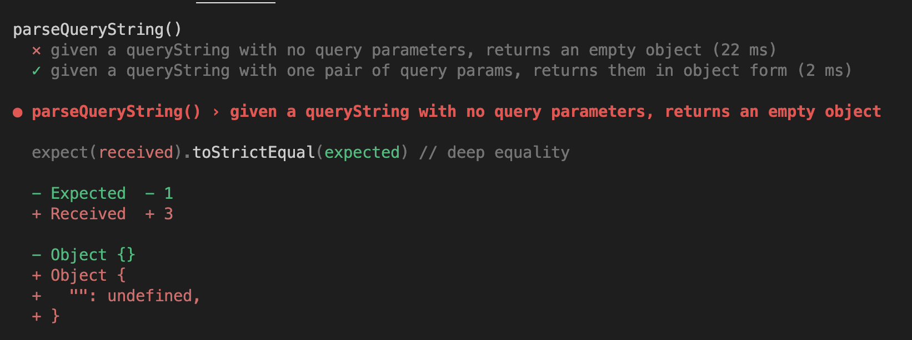

+++
title = 'Access with variables'

time = 30
[objectives]
    1='Explain when square bracket notation may be necessary to access an object'
    2='Explain why a previous test breaks once the implementation changes'
[build]
  render = 'never'
  list = 'local'
  publishResources = false

+++

We can mutate an object using `.` dot notation. However, if we look at the return value in the previous implementation we get `{key: "banana"}`.
Let's take another look at our current implementation of `parseQueryString`:

```js {linenos=table,hl_lines=["5"],linenostart=1}
function parseQueryString(queryString) {
  const queryParams = {};

  const [key, value] = queryString.split("="); // will hold ['fruit', 'banana']
  queryParams.key = value; // mutate the queryParams object

  return queryParams;
}
```

On line 4, we're declaring an **identifier** called `key`. When `parseQueryString` is called with `"fruit=banana"` then `key` will be assigned the value of `"fruit"`.

> We want to add a property name to the object that is the value of the `key` variable and not the string `"key"`.
> We can do this with square bracket notation:

```js {linenos=table,hl_lines=["5"],linenostart=1}
function parseQueryString(queryString) {
  const queryParams = {};

  const [key, value] = queryString.split("="); // will hold ['fruit', 'banana']
  queryParams[key] = value; // will set the property name with the value of the key variable

  return queryParams;
}
```

We can't use dot syntax if we don't know what the name of the key is going to be. Square bracket notation is more powerful than dot notation, because it lets us use any expression as a key.



===[[Tests]]===
We've currently got the following test suite:

```js
describe("parseQueryString()", () => {
  test("given a queryString with no query parameters, returns an empty object", function () {
    const input = "";
    const currentOutput = parseQueryString(input);
    const targetOutput = {};

    expect(currentOutput).toEqual(targetOutput);
  });
  test("given a queryString with one pair of query params, returns them in object form", function () {
    const input = "fruit=banana";
    const currentOutput = parseQueryString(input);
    const targetOutput = { fruit: "banana" };

    expect(currentOutput).toEqual(targetOutput);
  });
});
```

===[[Feedback]]===
We've currently got the following test suite:



===[[🧠 Explain]]===
We've got a situation where the first test case (for an empty string) is no longer working.
Explain why this test case is no longer passing for the first test case. **Playing computer** will help you to explain why!



Sometimes when we're solving a problem, it can be useful to work out different cases (like empty query strings, or non-empty query strings) and work out how to solve them separately, then come back when we think we understand the cases and work out how to put the solutions together into one function. This often is useful when there are really different cases to consider.

Most of the time, though, it's useful to try to keep all of our existing tests passing as we cover more cases. If we wanted to do that here, we could make our function be something like:

```js
function parseQueryString(queryString) {
  const queryParams = {};
  if (queryString.length === 0) {
    return queryParams;
  }

  const [key, value] = queryString.split("="); // will hold ['fruit', 'banana']
  queryParams[key] = value; // will set the property name with the value of the key variable

  return queryParams;
}
```

Here, we only add a key to the object if there was actually something to add - we return early if there's no extra work to do.
