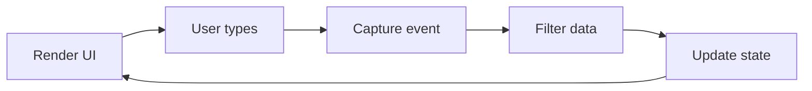

+++
title = 'Break down the problem'

time = "30"
hide_from_overview = true
[objectives]
    1='Identify and sequence sub tasks'
[build]
  render = 'never'
  list = 'local'
  publishResources = false

+++

We already have a website for displaying film listings.

Let's think through building this film search interface step-by-step. Write down your sequence of steps to build this interface.

> _Given_ a view of film cards and search box  
> _When_ a user types in the search box  
> _Then_ the view should update to show only matching films.


===[[Draw your plan]]===

===[[Write your plan]]===

1. 🔍 Display search box and initial list of films
1. 🦻🏽 Listen for user typing in search box
1. 🎞️ Capture latest string when user types
1. 🎬 Filter films list based on search text
1. 📺 Update UI with filtered list



The key aspects we need to handle are capturing input and updating UI.

### 👂🏿 Capturing Input

We need to listen for the [`input`](https://developer.mozilla.org/en-US/docs/Web/API/Element/input_event) event on the search box to react as the user types. When the event fires, we can read the updated string value from the search box input element.

### 🎬 Filtering Data

Once we have the latest search text, we can filter the list of films. We can use JavaScript array methods like [`.filter()`](https://developer.mozilla.org/en-US/docs/Web/JavaScript/Reference/Global_Objects/Array/filter) to return films that match our search string.

### 🆕 Updating UI

With the latest filtered list of films in hand, we re-render these films to display the updated search results. We can clear the current film list and map over the filtered films to add updated DOM elements.

Thinking through these aspects separately helps frame the overall task. Next we can focus on each piece:

1. 👂🏿 Listening for input
2. 🎬 Filtering data
3. 🆕 Re-rendering UI with the films example.


We clear the current film list and then add elements based on our new list.


### 💭 Why clear out the list and make new elements?

We could go through the existing elements, and _change_ them. We could add a `hidden` CSS class to ones we want to hide, and remove a `hidden` CSS class from those we want to show.

But we prefer to clear out the list and make _new_ elements. We do not want to change existing ones.

#### 🧘🏽‍♂️ Do the simplest thing

It is **simpler** because we have fewer things to think about. With either approach, we need to solve the problem "which films do we want to show". By clearing out elements, we then only have to solve the problem "how do I display a film?". We don't also need to think about "how do I hide a film?" or "how do I show a film that was hidden?".

#### 🍱 A place for everything

In our pattern we only deal with how we turn data into a card in one place. If we need to worry about _changing_ how a card is displayed, that would have to happen somewhere else.

By making new cards, we avoid thinking about how cards change.

We can focus.
