+++
title = 'Latency'

time = 5
[objectives]
  1='Define latency'
[build]
  render = 'never'
  list = 'local'
  publishResources = false

+++

```mermaid
graph LR
    fetch[(🐕 fetch)] --> |sends a| Request{📤 Request}
    Request --> |has a latency| TimeProblem[🗓️ Time Problem]
```

Instead of already having our data, we are now sending a request over the network to another computer, and then waiting for that computer to send us a response back. Now that our data is going on a journey over a network, we introduce the problem of **latency**.

Latency is the time taken for a request to traverse the network.

> 💡 Network latency is travel time.

Why is latency a problem? Because it means we need to **wait** for our data. But our program can only do one thing at a time. If we stopped our program to wait for data, then we wouldn't be able to do anything else (like show the rest of the page, or respond to a user clicking in the page). We need to handle this time problem.

Programming often involves time problems, and latency is just one of them.
