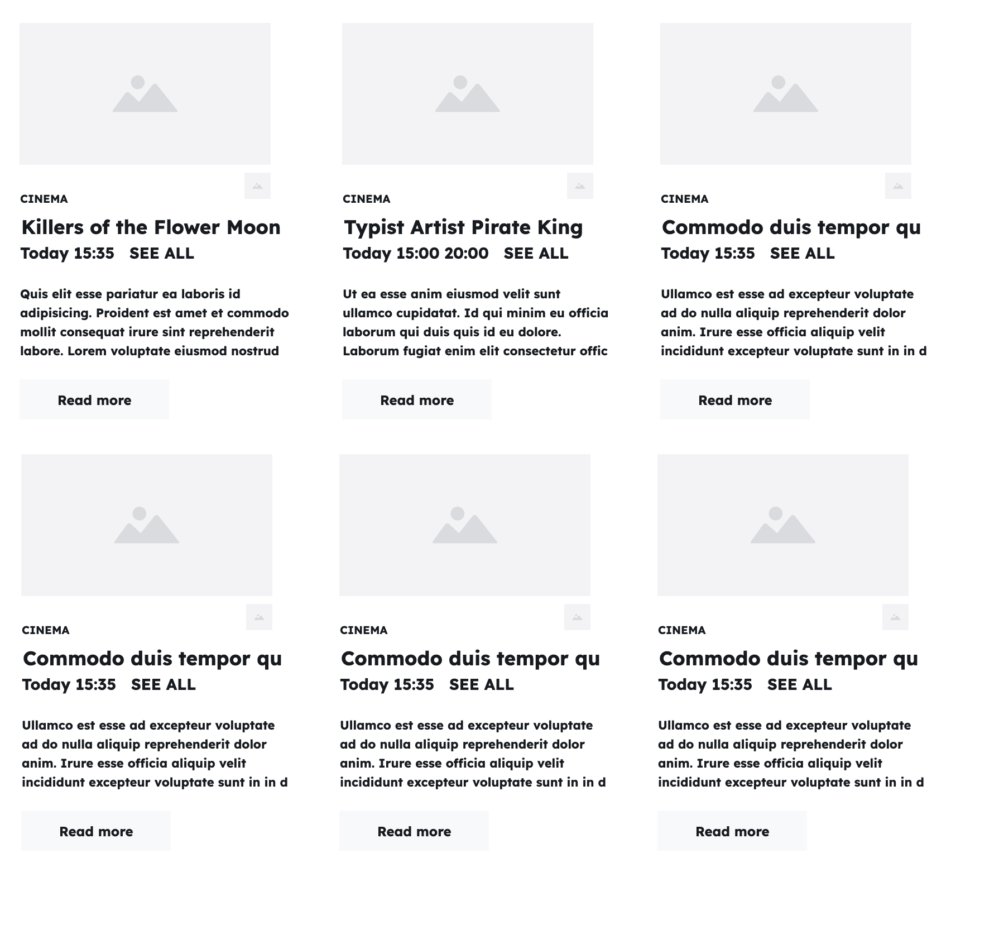

+++
title = 'Cinema listings'

time = 20
hide_from_overview = true
[objectives]
    1='Define an acceptance criterion for building a web page'
    2='Use a wireframe to make a basic design for the web page'
[build]
  render = 'never'
  list = 'local'
  publishResources = false

+++

Suppose you're building a user interface to display the films that are now showing on a film website. We need to render some cinema listings in the user interface. Let's define an acceptance criterion:

> _Given_ a list of film data  
> _When_ the page first loads  
> _Then_ it should display the list of films now showing, including the film title, times and film certificate.


===[[Wireframe]]===

===[[Data]]===
Here are some example film data:

```js
const films = [
  {
    title: "Killing of Flower Moon",
    director: "Martin Scorsese",
    times: ["15:35"],
    certificate: "15",
    duration: 112,
  },
  {
    title: "Typist Artist Pirate King",
    directory: "Carol Morley",
    times: ["15:00", "20:00"],
    certificate: "12A",
    duration: 108,
  },
];
```



To visualise the user interface, we can use a A wireframe is a basic outline of a web page used for design purposes. This films wireframe is built by reusing the sameA **UI component** is a reusable, self-contained piece of the UI. UI components are like lego blocks you can use to build websites. Most websites are made by "composing" components in this way.. Each film object is rendered as a card component. To build this user interface, we will start with data in the form of an array of objects, each with similar properties.

Our task will be to build the film listings view from this list of data.

Create an `index.html` file and follow along.
