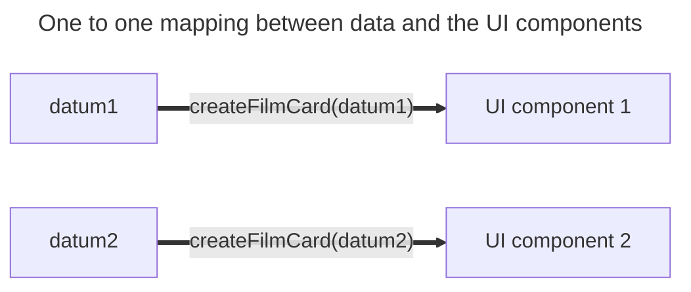

+++
title = 'One-to-one mappings'

time = 15
hide_from_overview = true
[objectives]
    1='Describe how to render a list of data'
[build]
  render = 'never'
  list = 'local'
  publishResources = false

+++

We can now render _any one_ film data object in the UI. However, to fully solve this problem we must render a list of all of the film objects. For each film object, we need to render a corresponding film card in the UI. In this case, there is a A **one-to-one mapping** associates every element in a set to exactly one element in another setbetween the data array and the UI components on the web page. Each item in the array matches a node in the UI. We can represent this diagrammatically by pairing up the data elements with their corresponding UI components:



> Given an array named `films`...

To create an array of card components we can iterate through the film data using a `for...of` loop:

```js
const filmCards = [];
for (const item of films) {
  filmCards.push(createFilmCard(item));
}

document.body.append(...filmCards);
// invoke append using the spread operator
```

However, there are alternative methods for building this array of UI components.
