+++
title = 'Promises'

time = 15
[objectives]
    1='Define a Promise'
    2='Log a Promise to the console'
[build]
  render = 'never'
  list = 'local'
  publishResources = false

+++



```mermaid
graph LR
    Asynchrony --> |delivered with| Promise{{🤝 Promises}}
    Promise --> |resolve to a| Response{📤 Response}
    Promise --> |join the| EventLoop{{Event Loop 🔁}}
```

To get data from a server, we make a request with `fetch`. We act on what comes back: the response. But what happens in the middle? We already know that JavaScript is single-threaded: it can only do one thing at a time.

So do we just stop and wait? No! We have a special object to handle this time problem. Put this code in a file and run it with node:

```js
const url = "https://api.github.com/users/SallyMcGrath"; // try your own username
const response = fetch(url);
console.log(response);
```

<details>
<summary>Your Promise should look like this:</summary>

```js
Promise {
  Response {
    [Symbol(realm)]: null,
    [Symbol(state)]: {
      aborted: false,
      rangeRequested: false,
      timingAllowPassed: true,
      requestIncludesCredentials: true,
      type: 'default',
      status: 200,
      timingInfo: [Object],
      cacheState: '',
      statusText: 'OK',
      headersList: [HeadersList],
      urlList: [Array],
      body: [Object]
    },
    [Symbol(headers)]: HeadersList {
      cookies: null,
      [Symbol(headers map)]: [Map],
      [Symbol(headers map sorted)]: null
    }
  },
  [Symbol(async_id_symbol)]: 54,
  [Symbol(trigger_async_id_symbol)]: 30
}
```

</details>

The `response` variable in this code is not labelling [the data](https://api.github.com/users/SallyMcGrath). It's labelling a [`Promise`](https://developer.mozilla.org/en-US/docs/Web/JavaScript/Reference/Global_Objects/Promise).

A promise is exactly what it sounds like: a promise to do something. You can use this promise object to _sequence_ your code. You can say, "When the data comes back, `then` do this."

You will explore Promises in more detail as you build more complex applications. For now, let's move on to `.then()`.
