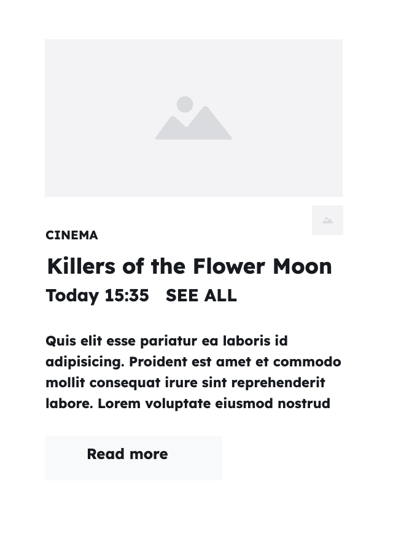

+++
title = 'Rendering one card'

time = 30
hide_from_overview = true
[objectives]
    1='Define a sub-goal for rendering data in the user interface'
[build]
  render = 'never'
  list = 'local'
  publishResources = false

+++

> 🎯 Sub-goal: Build a film card component

To break down this problem, we'll render a single datum, before doing this for the whole list. Here's one film:

```js
const film = {
  title: "Killing of Flower Moon",
  director: "Martin Scorsese",
  times: ["15:35"],
  certificate: "15",
  duration: 112,
};
```

Starting with this object, we'll focus _only_ on building this section of the user interface:

<details>
<summary> 🖼️ Open this wireframe of single film card</summary>



</details>
