+++
title = '.then()'

time = 30
[objectives]
    1='Chain then() on to a Promise'
[build]
  render = 'never'
  list = 'local'
  publishResources = false

+++



```mermaid
graph LR
    Promise{{🤝 Promises}} --> |resolve to a| Response{📤 Response}
    Response ---> |sequence with| then{{🪆️ then}}
```

[`.then()`](https://developer.mozilla.org/en-US/docs/Web/JavaScript/Reference/Global_Objects/Promise/then) is a method that all `Promise`s have. You can interpret this code:

```js
const url = "https://api.github.com/users/SallyMcGrath";
const callback = (response) => response.json(); // .json() is an instance method that exists for all Response objects.
fetch(url).then(callback);
```

1. _given_ a request to `fetch` some data
2. _when_ the `response` comes back / the promise resolves to a [response object](https://developer.mozilla.org/en-US/docs/Web/API/Response)
3. `then` do this next thing with the data / execute this callback

The `.then()` method takes in a [callback](https://www.w3schools.com/js/js_callback.asp) function that will run once the promise resolves.

We can also inline the `callback` variable here - this code does exactly the same as the code above:

```js
const url = "https://api.github.com/users/SallyMcGrath";
fetch(url).then((response) => response.json());
```

It's a similar idea as the event loop we have already investigated, but this time we can control it clearly. The `.then()` method _queues_ up callback functions to execute in sequence once the asynchronous operation completes successfully. This allows us to write code as if it was happening in time order.


The `then()` method of a `Promise` always returns a new `Promise`.


We can chain multiple `.then()` calls to run more logic, passing the resolved value to the next callback in the chain. This allows us to handle the asynchronous response in distinct steps. Let's create a getProfile function in a file, call it, and try running the file with node:

```js
const getProfile = (url) => {
  return fetch(url)
    .then((response) => response.json()) // This callback consumes the response string and parses it as JSON into an object.
    .then((data) => data.html_url) // This callback takes the object and gets one property of it.
    .then((htmlUrl) => console.log(htmlUrl)); // This callback logs that property.
};
getProfile("https://api.github.com/users/SallyMcGrath");
```

So `then` returns a _new_ `Promise`, and you can call `then` again on the new object. You can chain Promises in ever more complex dependent steps. This is called [Promise chaining](https://developer.mozilla.org/en-US/docs/Web/JavaScript/Guide/Using_promises#chaining).

It's important to understand some of what is happening with Promises and `then`. But for the most part, you will not be writing code in this style.
