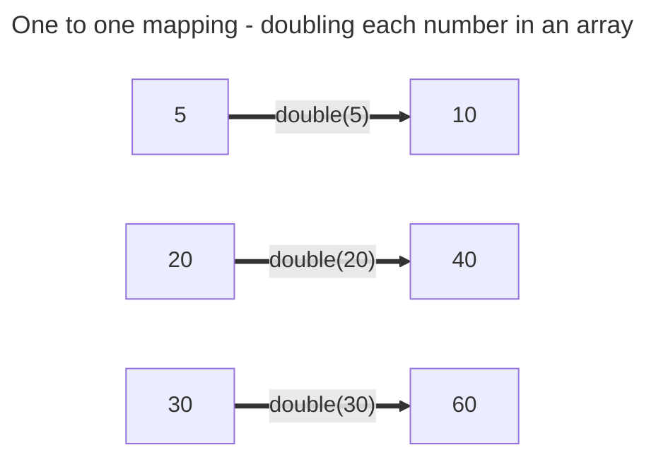

+++
title = 'Using map'

time = 60
[objectives]
    1='Describe how to use map'
[build]
  render = 'never'
  list = 'local'
  publishResources = false

+++

We want to create a new array by applying a function to each element in the starting array. Earlier, we used a `for...of` statement to apply the function `createFilmCard` to each element in the array. However, we can also build an array using [the `map` array method](https://developer.mozilla.org/en-US/docs/Web/JavaScript/Reference/Global_Objects/Array/map). `map` is a  A **higher-order function** is a function that takes another function as an argument or returns a new function. In this case, it means we pass a function as an argument to `map`. Then `map` will use this function to create a new array.

Work through this `map` exercise. It's important to understand map before we apply it to our film data.

```js
const arr = [5, 20, 30];

function double(num) {
  return num * 2;
}
```

Our goal is to create a new array of doubled numbers given this array and function. We want to create the array `[10, 40, 60]`. Look, it's another "one to one mapping".



We are building a new array by applying `double` to each item. Each time we call `double` we store its return value in a new array:

```js
function double(num) {
  return num * 2;
}

const numbers = [5, 20, 30];
const doubledNums = [
  double(numbers[0]),
  double(numbers[1]),
  double(numbers[2]),
];
```

But we want to generalise this. Whenever we are writing out the same thing repeatedly in code, we probably want to make a general rule instead. We can do this by calling `map`:

```js {linenos=table,hl_lines=["6"], linenostart=1}
function double(num) {
  return num * 2;
}

const numbers = [5, 20, 30];
const doubledNums = numbers.map(double);
```



===[[🎨 Array visualiser]]===

<iframe title="array-visualiser" width="768" height="432" src="https://array-visualizer.codeyourfuture.io/" frameborder="0" scrolling="no" allow="fullscreen; clipboard-read; clipboard-write" allowfullscreen></iframe>

Use the array visualiser to observe what happens when `map` is used on the `arr`. Try changing the elements of `arr` and the function that is passed to `map`. Answer the following questions in the visualiser:

- What does `map` do?
- What does `map` return?
- What parameters does the `map` method take?
- What parameters does the callback function take?

===[[🎮 Play computer]]===

<iframe title="play-computer-arrays" width="1100" height="400" frameborder="0" src="https://pythontutor.com/iframe-embed.html#code=function%20double%28num%29%20%7B%0A%20%20return%20num%20*%202%3B%0A%7D%0A%0Aconst%20arr%20%3D%20%5B5,%2020,%2030%5D%3B%0Aconst%20doubledNums%20%3D%20arr.map%28double%29%3B&codeDivHeight=400&codeDivWidth=350&cumulative=false&curInstr=0&heapPrimitives=nevernest&origin=opt-frontend.js&py=js&rawInputLstJSON=%5B%5D&textReferences=false"> </iframe>

Play computer with the example to see what happens when the `map` is called.


