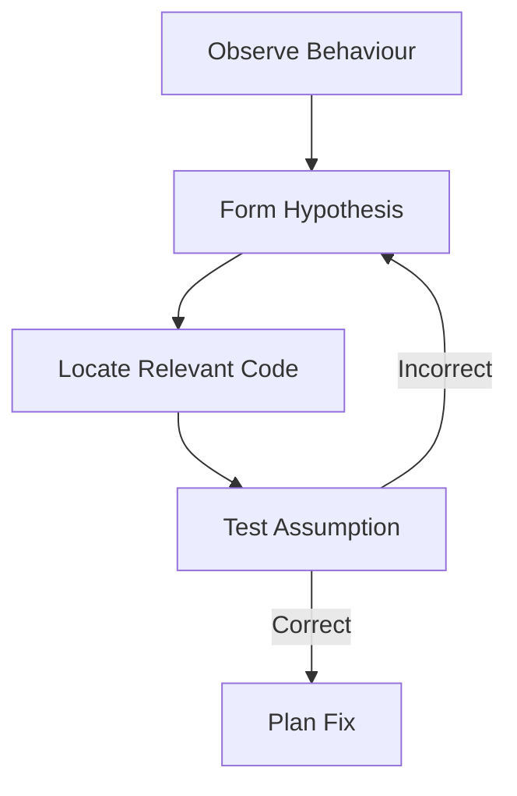

+++
title = "Debugging legacy code"
emoji="🐞"
time = 60
[objectives]
    1="Identify the code responsible for a bug reported against existing code"
    2="Identify the root cause of a bug reported against existing code"
    3="Apply systematic debugging techniques to locate and fix issues"
    4="Test assumptions without breaking functionality"
+++

> Debugging legacy code is like being a detective at a crime scene. Look for clues, follow the evidence, and test your theories carefully.

We're detectives again, using our logical reasoning techniques to detect our code crimes. Effective debugging in legacy codebases is the same as debugging your own code, honestly.

#### Observe Before Acting

- Reproduce the issue consistently
- Document exact steps, inputs, and outputs
- Compare expected vs actual behaviour

#### Read More, Change Less

- Understand before modifying
- Use comments or notes to mark suspicious code
- Look for patterns in the codebase

### Use Strategic Debugging

- Console logging/print statements at key points
- Breakpoints in logical places
- Check database queries and API responses

#### Above All, Test Your Assumption

- "I think this function handles character limits..."
- "This route seems to process hashtags..."
- Falsify each assumption before proceeding

### Common Bug Patterns in Legacy Code

Legacy code doesn't always mean _bad_ code. Even in good code, bugs can creep in. There are some really common places that bugs come from, which are all mainly around a mismatch between expectations/assumptions, and actual behaviour. Look for:

- **Side Effects**: One action unexpectedly affects other parts of the system
- **Unclear Boundaries**: Responsibility spread across multiple components creates unclear request flow
- **Outdated Comments**: Documentation that no longer matches actual behaviour

### 🧑‍🎓 Activity: Bug Hunt

Review the first bug report: "Character limiting is only checked client-side"

1. Where would you _expect_ character limiting to be implemented?
2. Find the client-side validation
3. Find the server-side route
4. Is there validation present? What's missing?
5. How could you test this using curl?
