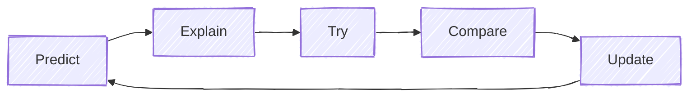

+++
title = "Debugging: Proposing and Discarding Hypotheses"
time = 30
[build]
  render = 'never'
  list = 'local'
  publishResources = false
[objectives]
    1="Apply scientific debugging methodology to legacy code"
    2="Formulate and test hypotheses systematically"
    3="Use browser debugging tools effectively with legacy applications"
+++


(You could take a moment to [refine the issue report](https://workshops.codeyourfuture.io/#reporting-bugs).
)

> 🧠 Recall that debugging is about forming and testing hypotheses. Each test brings you closer to understanding the system's intended and actual behaviour.

<details>
<summary>Remind yourself of your debugging skills</summary>



You have used this strategy many times before at , and loads of [debugging](https://developer.chrome.com/docs/devtools/javascript/reference) too.

</details>

With the application running, reproduce the issue by creating a bloom with the hashtag #do and navigating to `/#/hashtag/do`. Open Devtools and trace the request flow, just as we did in Navigation.

Yikes! As soon as we open the [Network panel](https://developer.chrome.com/docs/devtools/network/overview#overview) we can see the app is making many many _many_ requests!

**Prediction**: there's some kind of loop in the system that's causing the page to refresh over and over. **Explanation**: the network panel is showing a lot of requests to the same endpoint.

We can see precisely which files are involved in this request in the [call stack](https://developer.mozilla.org/en-US/docs/Glossary/Call_stack). This [stack trace](https://developer.chrome.com/blog/print-out-a-quick-stack-trace-from-the-console) allows us to reduce our problem domain to these 5 files.

```js
_apiRequest @ //front-end/lib/api.mjs:33
getBloomsByHashtag @ //front-end/lib/api.mjs:163
hashtagView @ //front-end/views/hashtag.mjs:20
handleRouteChange @ //front-end/lib/router.mjs:24
(anonymous) @ //front-end/index.mjs:44
updateState @ //front-end/lib/state.mjs:26
```

Remembering what we just learned, `Cmd+P` and open `api.mjs`, `Cmd+F` to jump to `_apiRequest`. This is a wrapper function that all these endpoints call, so it's not likely to be the problem if only this one view is refreshing.

1. Read `getBloomsByHashtag`. Is there a clue in here?
1. What is calling this function? Use `fn+Shift+F12` to navigate to `hashtagView`. **Prediction:** if we comment out the `apiService.getBloomsByHashtag` call, the page will stop refreshing. Try it.

This should be a clue.

> [!TIP]
> Legacy code is like a crime scene. Use your detective skills to understand how it happened.

<details>
<summary>

Our _expected_ request flow is:</summary>

<figure>


<figcaption>

`hashtagView` calls `apiService.getBloomsByHashtag` which calls `_apiRequest` which makes a request to the server. Success updates the state which dispatches a state-change event that the router listens for and calls `hashtagView` again to render the page with the blooms.

</figcaption>
</figure>
</details>

<details>
<summary>

But our _actual_ flow is:</summary>

<figure>


<figcaption>

`hashtagView` calls `apiService.getBloomsByHashtag` which calls `_apiRequest` which makes a request to the server. Success updates the state which dispatches a state-change event that the router listens for and calls `hashtagView` that calls `apiService.getBloomsByHashtag` which calls `_apiRequest` which makes a request to the server...

</figcaption>
</figure>

</details>

This is where debugging legacy code can be faster than a greenfield application. This application is _working_, and other views _don't_ have this problem. So we can look at other views, and spot the difference. In `views/profile.mjs` for example, we call the apiService inside a conditional:

```js
// Only fetch profile if we don't have it or if it's incomplete
if (!existingProfile || !existingProfile.recent_blooms) {
  apiService.getProfile(username);
}
```

This is _different_ to how we are using `apiService` for hashtags. Maybe this is intentional, or maybe this is a violation of a pattern.

1. **Hypothesis**: The `hashtagView` is calling `apiService.getBloomsByHashtag` multiple times.
1. **Test**: Comment out the `apiService.getBloomsByHashtag` call in `hashtagView`.
1. **Result**: The page stops refreshing... and is also blank.
1. **Conclusion**: The loop is caused by `hashtagView` calling `apiService.getBloomsByHashtag` multiple times.

Uncomment the line and don't make any further changes to the codebase. Move on to the next step.
