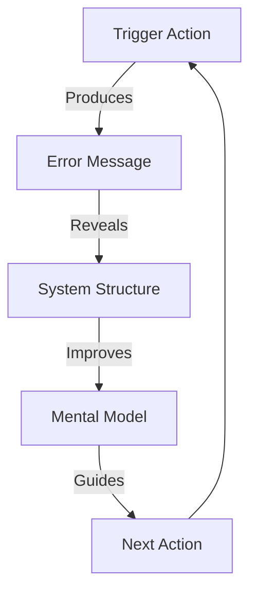

+++
title = "Errors and Signals: Building Your Mental Model"
time = 20
emoji= "🚦"
[build]
  render = 'never'
  list = 'local'
  publishResources = false
[objectives]
    1="Interpret error messages as signals about system behaviour"
    2="Use errors to build a mental model of the codebase"
    3="Apply error-driven exploration to understand complex systems"
+++

> Error messages are valuable signals that help us understand how a system works. By interpreting these signals effectively, we can build a robust mental model of complex codebases.



<figure>



<figcaption>Errors reveal system structure through feedback loops</figcaption>
</figure>

<--->

> _Given_ an unfamiliar system  
> _When_ we encounter errors  
> _Then_ we use them as clues  
> _And_ refine our understanding  
> _Until_ our mental model matches reality



## Error Messages as Information Sources

When working with legacy code, each error reveals something about the system:

1. **Where**: Stack traces show code structure and execution paths
2. **What**: Error messages describe what went wrong
3. **Why**: Error contexts hint at the underlying logic or expectations
4. **How**: The system's error handling reveals architectural patterns


Like archaeologists examining artifacts, we can learn about a system's design and evolution from the errors it produces. Each error tells a story about how the code was built and what it expects.


## Reading Stack Traces in Purple Forest

Let's examine a typical error from Purple Forest:

```
Uncaught TypeError: Cannot read property 'username' of undefined
    at createBloomComponent (bloom.mjs:12)
    at render (render.mjs:24)
    at renderTimeline (timeline.mjs:43)
    at loadTimelineView (views.mjs:78)
    at handleRouteChange (router.mjs:56)
    at window.addEventListener (index.mjs:22)
```

This stack trace tells us:

1. The rendering flow: index → router → views → timeline → render → bloom
2. A data dependency: bloom components expect objects with a username property
3. The component hierarchy: timeline components contain bloom components

From this single error, we've learned significant information about the application structure.

## Building Your Mental Model Incrementally

When facing a new legacy system, use errors as stepping stones to understanding:


===[[Step 1: Create Errors Deliberately]]===
Don't be afraid to trigger errors intentionally:

1. Comment out code to see what depends on it
2. Add console.log statements to trace execution
3. Modify values to see how the system reacts
4. Try common edge cases to reveal error handling

Each error will teach you something about the system.

===[[Step 2: Map Error Patterns]]===
Look for patterns in the errors you encounter:

1. Similar error messages in different components
2. Common dependencies in stack traces
3. Error handling patterns across the codebase
4. Missing error handling (unhandled exceptions)

These patterns reveal the system's architecture and design philosophy.

===[[Step 3: Form Hypotheses]]===
Use errors to form testable hypotheses:

1. "If I change X, I expect Y to happen"
2. "This component probably depends on data format Z"
3. "This error suggests these two modules are tightly coupled"

Then verify your hypotheses with targeted changes.


## Error Handling in Purple Forest

Purple Forest implements centralised error handling through its error component. By examining this pattern, we learn about the application's architecture:

```javascript
// Excerpt from api.mjs
function handleApiError(error) {
  // Authentication errors
  if (error.status === 401 || error.status === 403) {
    state.destroyState();
    router.navigateTo("#login");
  }

  // Show error dialog for all errors
  renderError(error.message || "An unexpected error occurred");
}
```

This reveals:

1. The application uses state management
2. Authentication is token-based
3. Errors are displayed through a centralised component
4. There's a distinction between auth errors and other errors

## Practical Exercise: Error Signals in Purple Forest


===[[Examine This Error]]===

```
Uncaught TypeError: Cannot read property 'posts' of undefined
    at renderTimeline (timeline.mjs:18)
    at loadHomeView (views.mjs:34)
    at handleRouteChange (router.mjs:42)
    at window.addEventListener (index.mjs:15)
```

What does this error tell you about the Purple Forest application?

===[[Analysis]]===
This error reveals:

1. The application expects 'posts' data to be available when rendering the timeline
2. The rendering flow goes from index → router → views → timeline
3. The timeline component depends on state that might not be initialised
4. Home view contains a timeline component

From this, we can infer that posts data should be loaded before rendering the timeline, possibly in the home view initialisation.

===[[Fix Approach]]===
Based on this error, we might:

1. Check if state is initialised in loadHomeView before rendering the timeline
2. Add a null check in the timeline component
3. Ensure posts data is loaded when navigating to the home view
4. Update our mental model to include this data dependency
   

## From Errors to Understanding

As you collect and interpret error signals, your mental model of the system improves. This leads to:

1. **Better predictions**: You can anticipate how the system will behave
2. **More targeted changes**: You know where to make modifications with minimal side effects
3. **Faster debugging**: You understand where problems are likely to occur
4. **Improved communication**: You can explain the system to others effectively


While errors provide valuable insights, they only reveal what's breaking—not necessarily what's working. Combine error-driven exploration with reading code and writing tests for a complete understanding.


## Apply Your Knowledge

Pick a feature in Purple Forest that you don't fully understand:

1. Try to use it in unexpected ways to generate errors
2. Examine the error messages and stack traces
3. Use this information to sketch a diagram of the feature's code structure
4. Verify your diagram by tracing through the actual code


