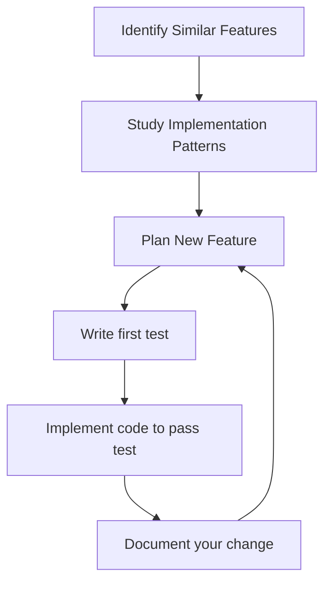

+++
title = "Extending legacy code"
description="Noticing and copying patterns"
time = 280
emoji= "🏗️"
[objectives]
    1="Add a feature to existing code"
    2="Maintain consistency with the codebase's patterns"
    3="Implement full-stack changes across multiple components"
+++

> Extending legacy code is like adding a new room to an existing house. Match the style, connect to existing utilities, and test that the foundation can support it.

Another way to think of this is of joining a game that is already being played. You need to read the rules, identify the strategies, and then make your move. But how do you get over your fear of breaking something?

1. **Find the Patterns**

   - How are similar features implemented?
   - What naming conventions are used?
   - How are responsibilities divided?

2. **Follow the Existing Architecture**

   - Use the same design patterns
   - Maintain separation of concerns
   - Mirror the code style (even if it's not your preference)

3. **Build Incrementally**

   - Get one piece working at a time
   - Test each component individually
   - Connect pieces only when each works separately

4. **Avoid Premature Refactoring**
   - Resist the urge to "fix everything"
   - Focus on adding the requested feature
   - Note potential refactoring for future work

### 🧑‍🎓 Activity: Feature Addition

Looking at the "unfollow user" feature request, consider:

- How is "follow" currently implemented?
- Where would you add the "unfollow" feature in the UI?
- What backend code will you need to change? Any?
- How will you match the existing style?

1. Plan your implementation approach
1. Implement the feature following the existing patterns
1. Test thoroughly across different user scenarios


