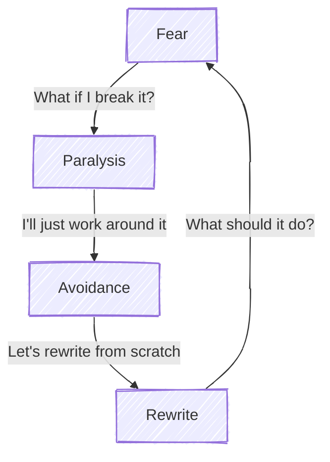
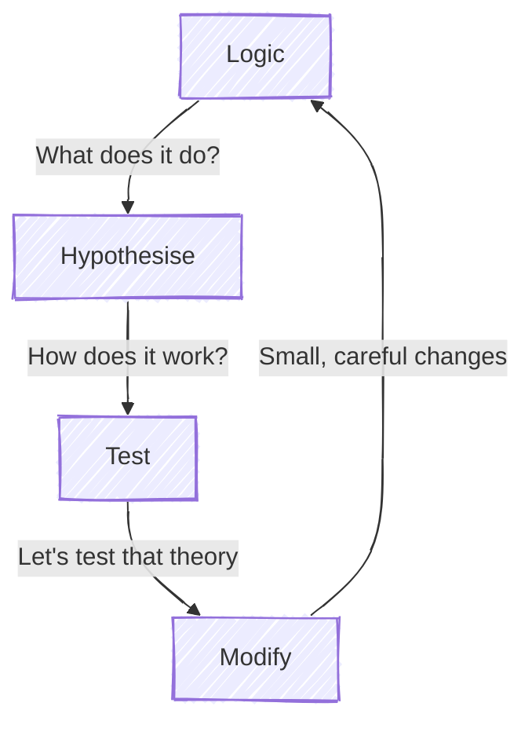

+++
title = "Fear and logic"
time = 60
emoji= "🗿"
[objectives]
    1="Sketch the flow of a request through existing code"
    2="Identify key components and their relationships"
    3="Map the architecture of an unfamiliar application"
+++

> Into the unknown



<--->



Do you remember your first day at ? You couldn't find the building, maybe, and you had no idea how the day would go. What on earth is a day plan, or a backlog, you thought to yourself. Perhaps you got frustrated: WHY are all my changes from last week in my new PR? HOW? It was incomprehensible. But you learned! You asked questions, you read the guides, and you built a mental map of the system.

You might have found your first code reviews challenging too. You worked on a project for days, JUST got it all working, and now someone is telling you to change it. Changing code you don't understand very well is risky.

Feeling a bit hesitant is fine. In fact, some caution is healthy. If code is working and it's doing something important for the business, we don't want to break it. But we also don't want to be _so_ fearful that we can't fix it or write new features. We must balance caution with curiosity, and approach legacy code with a structured, logical plan.

A good rule here is that before we change something, we must explain why it's like that in the first place.

### Chesterton's Fence: No Before You Know

https://www.youtube.com/watch?v=qPGbl2gxGqI
