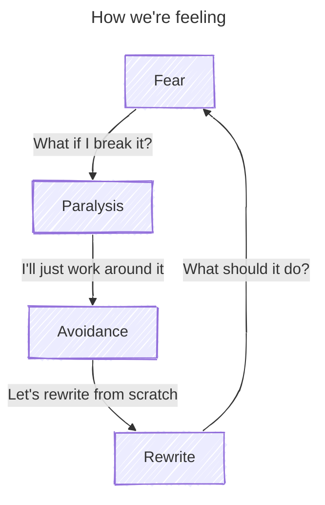
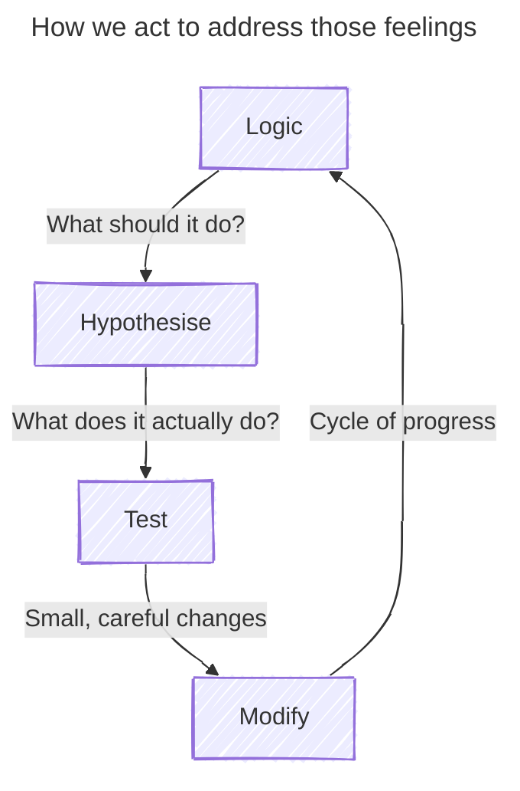

+++
title = "Fear and logic"
time = 15
[objectives]
    1="Define and explain Chesterton's Fence"
+++

Do you remember your first day at ? You couldn't find the building, maybe, and you had no idea how the day would go. What on earth is a day plan, or a backlog, you thought to yourself. Perhaps you got frustrated: _why_ are all my changes from last week in my new PR? **How**?! It was incomprehensible. But you learned! You asked questions, you read the guides, and you built a mental map of the system.

You might have found your first code reviews challenging too. You worked on a project for days, _just_ got it all working, and now someone is telling you to change it. Changing code you don't understand very well feels risky.

Feeling a bit hesitant is fine. In fact, some caution is healthy. If code is working and it's doing something important for the business, we don't want to break it. But we also don't want to be _so_ fearful that we can't fix it or write new features. We must balance caution with curiosity. We will approach legacy code with a structured, logical plan.



<--->



A good rule here is [Chesterton's Fence](https://www.youtube.com/watch?v=qPGbl2gxGqI{). This says that before we change something, we must [explain why](https://thoughtbot.com/blog/chestertons-fence) it's like that in the first place.

In code, Chesterton's Fence comes up a lot when we read code that looks complicated. It's easy to think "This code could be simpler". And maybe it could! There are a lot of reasons code is more complicated than it could be. Maybe it is complicated because:

- ✅ the person who wrote it didn't know a better way. If so, we can simplify it.
- ✅ the simpler way was only introduced to the language after the code was written. If so, we can simplify it.
- 🚫 we want to support old versions of the language when the simpler way didn't exist. If so, we can't simplify it: we would break something important!
- 🚫 some important edge-case we hadn't considered. If so, we need to understand that edge-case before we can change it, or we'll break it.

_Understanding why_ is crucial here. Tests can help us to understand. If we simplify the code and a test for a particular edge-case breaks, we found out why the code was more complicated! Comments can help too. A comment saying _"We don't do the simpler thing because it doesn't handle `undefined` properly"_ tells us why the code is more complicated. But sometimes legacy code doesn't have useful tests or comments.
