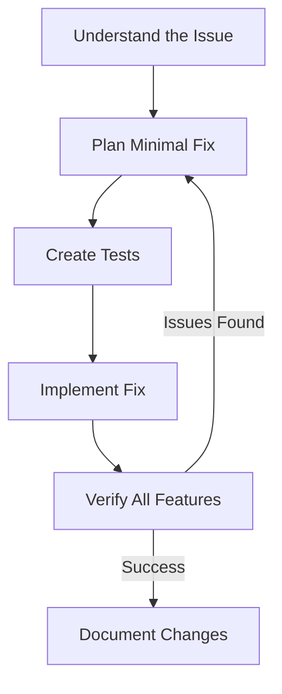

+++
title = "Fixing legacy code"
description ="One thing at a time"
time = 90
emoji= "🔧"
[objectives]
    1="Identify and implement a fix for a bug in existing code"
    2="Apply targeted fixes to existing code"
    3="Test changes thoroughly to avoid regressions"
    4="Document your changes appropriately"

+++

> Fixing legacy code is like performing surgery. Make precise, careful changes with minimal side effects and a clear recovery plan.

The key to fixing legacy code is to make targeted, minimal changes that solve the problem without creating new ones:

1. **The Rule of Minimal Change**

   - Fix only what's broken
   - Respect the existing architecture
   - Avoid rewriting unless absolutely necessary

2. **Test Before and After**

   - Verify the bug exists before fixing
   - Test the fix thoroughly
   - Check that other features still work

3. **Consider Side Effects**

   - Will this fix affect other parts of the system?
   - Are there similar bugs elsewhere?
   - Could this break existing assumptions?

4. **Document Your Changes**
   - Comment why, not just what
   - Update any documentation
   - Keep notes on your process for future reference

### 🧑‍🎓 Activity: Surgical Fixing

In your backlog, you have some bugs to fix

1. First, reproduce and verify the bug exists
2. Locate the code responsible for the issue
3. Write down your fix plan before making changes
4. Implement the minimal necessary change
5. Test with various inputs (spaces, special characters)
6. Run existing tests to check nothing else is broken
