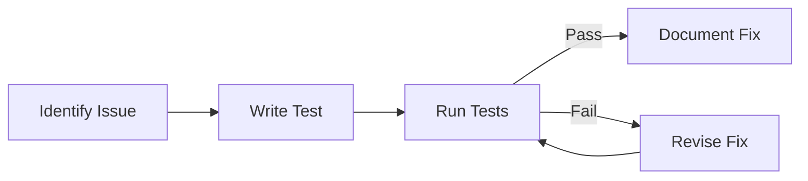

+++
title = "Fixing: Targeted Changes with Test Support"
time = 30
emoji= "🔧"
[build]
  render = 'never'
  list = 'local'
  publishResources = false
[objectives]
    1="Make small, targeted fixes to legacy code"
    2="Use tests to verify fixes don't break existing functionality"
    3="Apply the scientific method to debugging and fixing"
    4="Document fixes and their rationale"
+++

> The fixing cycle protects against regressions



> _Given_ a legacy codebase with a bug  
> _When_ we identify the root cause  
> _Then_ we make the smallest possible fix  
> _And_ verify with tests that nothing else breaks  
> _And_ document what we did and why

## The Scientific Method for Fixing

Approaching fixes with a scientific mindset leads to better results:

1. **Observe**: Note the symptoms and context of the bug
2. **Hypothesise**: Form a theory about the cause
3. **Test**: Create a test that reproduces the issue
4. **Experiment**: Make a minimal change to fix the issue
5. **Verify**: Run tests to ensure the fix works and doesn't break anything else
6. **Document**: Record what you learned and why you made the change

This systematic approach prevents the "fix one bug, create two more" problem common in legacy code.

## Targeted Fixes in Purple Forest

Let's examine a common issue in Purple Forest and how we might fix it:

```javascript
// Bug: Posts sometimes appear with undefined username
function createBloomComponent(template, data) {
  const fragment = template.content.cloneNode(true);
  const username = fragment.querySelector(".bloom-username");

  // The bug: Sometimes data.username is undefined
  username.textContent = data.username;

  return fragment;
}
```

A safe fix would be:

```javascript
function createBloomComponent(template, data) {
  const fragment = template.content.cloneNode(true);
  const username = fragment.querySelector(".bloom-username");

  // Fixed: Add a null check
  username.textContent = data.username || "Unknown User";

  return fragment;
}
```

This fix is:

1. **Minimal**: Changes only what's necessary
2. **Defensive**: Handles the edge case gracefully
3. **Non-disruptive**: Maintains existing functionality for valid data


When fixing legacy code, prefer defensive programming techniques that handle edge cases gracefully rather than assuming perfect input.


## Test-Supported Fixes

Before implementing a fix, create a test that confirms the issue:

```javascript
test("Bloom component handles missing username", () => {
  // Given a post with missing username
  const postData = { content: "Test post", username: undefined };

  // When creating a bloom component
  const component = createBloomComponent(bloomTemplate, postData);

  // Then it should display 'Unknown User'
  const username = component.querySelector(".bloom-username");
  expect(username.textContent).toBe("Unknown User");
});
```

This test:

1. Documents the issue
2. Verifies your fix works
3. Prevents regression if someone changes the code later


===[[Least Invasive Fix]]===
The least invasive fix addresses the immediate issue without changing the overall structure:

```javascript
// Before
doSomething(data.property);

// After
if (data && data.property) {
  doSomething(data.property);
}
```

This approach is best when:

- You need to make a quick fix
- The bug is isolated
- You don't have time for larger refactoring

===[[Refactoring Fix]]===
A refactoring fix addresses the root cause and improves the code:

```javascript
// Before
function processData(data) {
  return data.value * 2;
}

// After
function processData(data) {
  if (!isValidData(data)) {
    return 0;
  }
  return data.value * 2;
}

function isValidData(data) {
  return data && typeof data.value === "number";
}
```

This approach is best when:

- The issue is symptoms of a deeper problem
- You have test coverage
- You can afford the time investment

===[[Architectural Fix]]===
An architectural fix addresses systemic issues:

```javascript
// Before: Data validation scattered throughout components

// After: Centralised validation in state management
function updateState(newData) {
  const validatedData = validateData(newData);
  state = { ...state, ...validatedData };
  notifyListeners();
}

function validateData(data) {
  // Centralised validation logic
}
```

This approach is best when:

- The same issue appears in multiple places
- You're dealing with a design flaw
- You have good test coverage and time
  

## Common Patterns for Safe Fixes

When fixing legacy code, these patterns often help:

1. **Guards**: Add checks before risky operations

   ```javascript
   // Before
   element.setAttribute("href", url);

   // After
   if (element && url) {
     element.setAttribute("href", url);
   }
   ```

2. **Default Values**: Provide fallbacks for missing data

   ```javascript
   // Before
   const name = user.name;

   // After
   const name = user?.name || "Anonymous";
   ```

3. **Early Returns**: Exit functions early when conditions aren't met

   ```javascript
   // Before
   function process(data) {
     const result = complexOperation(data);
     return formatResult(result);
   }

   // After
   function process(data) {
     if (!data) return null;
     const result = complexOperation(data);
     return formatResult(result);
   }
   ```

4. **Feature Flags**: Wrap new/fixed code in toggleable flags

   ```javascript
   // Before
   function calculateTotal() {
     // Old calculation with bug
   }

   // After
   function calculateTotal() {
     if (FLAGS.USE_NEW_CALCULATION) {
       // New calculation
     } else {
       // Old calculation
     }
   }
   ```

## Fix Documentation

When you've fixed an issue, document it properly:

```javascript
/**
 * Creates a bloom component from template and data
 *
 * @param {HTMLTemplateElement} template - The bloom template
 * @param {Object} data - The post data
 * @param {string} [data.username] - The username (may be undefined)
 * @returns {DocumentFragment} The populated component
 *
 * @fix 2023-05-12 - Added null check for username to prevent
 * "Cannot read property 'textContent' of undefined" error
 * when posts have no username property.
 */
function createBloomComponent(template, data) {
  // Implementation with fix
}
```

Good fix documentation includes:

1. What was fixed
2. Why it was fixed
3. How it was fixed
4. Any potential side effects
5. Any related issues or tests

## Practical Exercise: Fix a Bug in Purple Forest


===[[The Bug]]===
Users report that when they try to visit a profile directly by URL (e.g., `#profile/username`), they sometimes see this error:

```
Uncaught TypeError: Cannot read property 'posts' of undefined
    at renderProfile (profile.mjs:22)
    at loadProfileView (views.mjs:56)
    at handleRouteChange (router.mjs:42)
```

Examine the relevant code:

```javascript
// In views.mjs
function loadProfileView(username) {
  destroy();

  apiService.getProfile(username).then((profile) => {
    render(
      [profile],
      getContainer("profile"),
      "profile-template",
      createProfileComponent
    );

    // This line causes the error:
    render(
      profile.posts,
      getContainer("profile-posts"),
      "bloom-template",
      createBloomComponent
    );
  });
}
```

===[[Create a Test]]===
Write a test that reproduces the issue:

```javascript
test("Profile view handles missing posts", () => {
  // Given a profile with no posts property
  const profile = { username: "testuser", bio: "Test bio" };
  // No posts property!

  // When loading the profile
  loadProfileView("testuser");

  // Mock the API response
  apiService.getProfile.mockResolvedValue(profile);

  // Then it should not crash
  // (This test would fail without a fix)
});
```

===[[Implement the Fix]]===
Add a defensive check:

```javascript
function loadProfileView(username) {
  destroy();

  apiService.getProfile(username).then((profile) => {
    render(
      [profile],
      getContainer("profile"),
      "profile-template",
      createProfileComponent
    );

    // Fixed: Check if posts exist before rendering
    if (profile.posts && profile.posts.length > 0) {
      render(
        profile.posts,
        getContainer("profile-posts"),
        "bloom-template",
        createBloomComponent
      );
    } else {
      // Show an empty state
      const emptyEl = document.createElement("p");
      emptyEl.textContent = "No posts yet";
      getContainer("profile-posts").appendChild(emptyEl);
    }
  });
}
```

This fix:

1. Checks if posts exist before trying to render them
2. Provides a better user experience with an empty state message
3. Prevents the error from occurring
   

## Apply Your Knowledge

Find a bug in Purple Forest by exploring the application, then follow these steps:

1. Document the bug (what happens, what should happen)
2. Write a test that reproduces the issue
3. Implement the smallest possible fix
4. Verify the fix with your test
5. Document your fix with comments

Remember: the goal is to make the smallest change that fixes the issue without introducing new problems.


