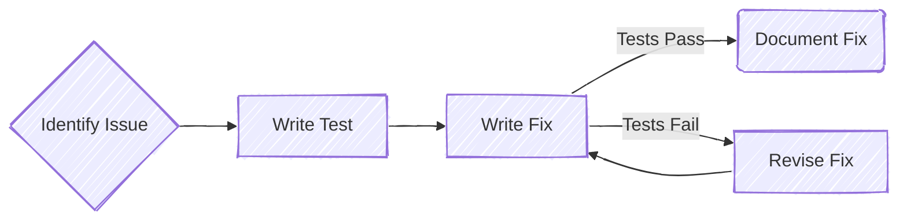

+++
title = "Fixing: Targeted Changes with Test Support"
time = 30
[build]
  render = 'never'
  list = 'local'
  publishResources = false
[objectives]
    1="Make a small, targeted fix to legacy code"
    2="Use tests to verify fixes don't break existing functionality"
    3="Document fixes and their rationale"
+++

> The fixing cycle protects against regressions



We have identified our issue and written our test(s). We've really done all the hard work already. Fixing the actual code is now simple.

Fix your code!

<details>
<summary>If you are really stumped, here's the fix</summary>

On line 20 of `views/hashtag.mjs`, only fetch if the hashtag has changed.

```js
if (hashtag !== state.currentHashtag) {
  apiService.getBloomsByHashtag(hashtag);
}
```

If you were tempted to write something like `if (state.hashtagBlooms?.length)`, consider: what would happen if you navigated to a hashtag view with no matching blooms in the database?

Try it and look in the network tab. Yikes! Another infinite loop. A conditional written presuming there is always content available is risky with user generated content. You can't rely on users!

What extra test could you write to cover this case? Write it.

</details>

### ✍🏾 Document your fix in your PR message.

Once you have got the entire fix working end to end with tests, open a PR with your changes. In your PR message, write everything that you needed to know to solve this problem. Be good to the reviewer, they're a good friend of yours.

### 📅 Schedule a revision

Schedule a revision in your calendar for one week from today to come back and review your own PR.
