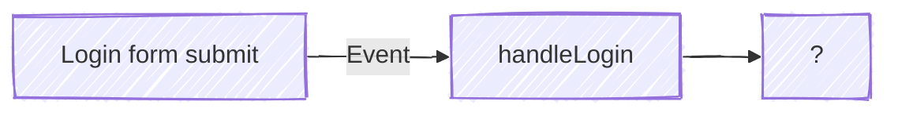
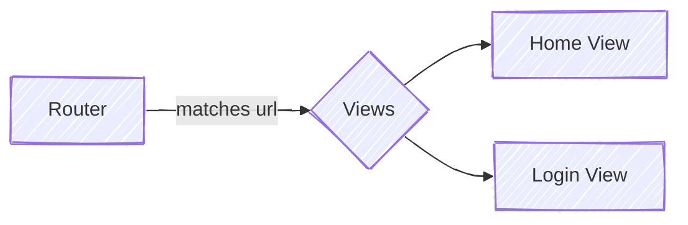

+++
title = "Finding things"
description="Finding Your Way Through Legacy Code"
time = 45
[build]
  render = 'never'
  list = 'local'
  publishResources = false
[objectives]
    1="Use IDE features to navigate an unfamiliar codebase"
    2="Trace a request flow through an application"
    3="Sketch system architecture"
+++

> By tracing request flows, drawing maps, and using code search tools, you can efficiently find your way through legacy code.

### 1. 🔍 Find

We're going to use the features of our IDE to help us. [VSCode](https://code.visualstudio.com/docs/getstarted/getting-started) has a million features for this, but we're just going to start with four: **Open** file, **Find** references, **Peek** definition, and **Find in** files.


===[[📂 1. Open]]===

#### 📂 1. Open file : `Cmd+P` or `Ctrl+P`

##### Code Along

Open the [Purple Forest codebase](https://github.com/CodeYourFuture/Module-Legacy-Code). Let's start at the router. Press `Cmd+P` and type `router`. O*p*en the file `router.mjs` and look at where it shows up in the [Explorer](https://code.visualstudio.com/docs/getstarted/userinterface#_explorer-view). What else is in that directory? Why have these files been grouped together? Write down your ideas.

What does this module do? What can it tell you about the system?

===[[🏷 2. References]]===

#### 🏷 2. Find references: `fn+Shift+F12`

##### Code Along

In `router.mjs` there is a function called `handleRouteChange`. What is using this function? Where is it called?

Press `fn+Shift+F12` . This will show you a [references panel](https://code.visualstudio.com/docs/getstarted/tips-and-tricks#_go-to-references) with links to every place that references this function. Double click on a reference to navigate to that file.

===[[🫣 3. Peek]]===

#### 🫣 3. Peek definition: `fn+F12`

##### Code Along

Now you're in `index.mjs` you can see _where_ the function is called, but you can't see the details of the function. Double click on the function name to select it and now press `Fn+Option+F12`. This opens the **[peek panel](https://code.visualstudio.com/docs/editor/editingevolved#_peek)**, which shows you the function definition _without_ leaving the file you're in.

===[[🗃 4. Find]]===

#### 🗃 4. [Find in files](https://code.visualstudio.com/docs/editor/codebasics?source=post_page-----4e234d504dd--------------------------------#_search-across-files): `Cmd+Shift+F` or `Ctrl+Shift+F`

##### Code Along

Is that everything to do with the router? Press `Cmd+Shift+F` and search for `route`. What else do you find?

Repeat this process with `navigateTo`. Deliberately practice using keyboard shortcuts to navigate your codebase. As the code you work with gets more complicated, scrolling through files becomes enormously time-consuming.



> [!TIP]
>
> You will learn these keyboard shortcuts over time.
>
> Use the commands now, but you won't be able to remember all the keyboard shortcuts at once. Try to learn one or two more each week. Use the [Command Palette](https://code.visualstudio.com/docs/getstarted/userinterface#_command-palette) to look up the keyboard shortcuts.

---

### 2. 📞 Trace a Request Flow

Open Purple Forest on your local machine. Read the README to get it running, and launch the frontend with [Live Server](https://marketplace.visualstudio.com/items?itemName=ritwickdey.LiveServer). Again, Devtools has a million features but we're going to use four: [Event Listener](https://developer.chrome.com/blog/easily-jump-to-event-listeners) panel, [Network](https://developer.chrome.com/docs/devtools/network) panel, [Sources](https://developer.chrome.com/docs/devtools/sources) panel, and [Local Storage](https://developer.chrome.com/docs/devtools/storage/localstorage) in the Application panel.



1. **Inspect** the login form and find the event listener in the listener panel. Make a prediction. What will happen, step by step, when we submit this form? Write down your answer in a numbered list. It doesn't have to be perfect, just jot down a quick prediction.

2. Open the Network panel. {}You can **find** the seed login details in the codebase you are reading!{} as user `sample`. What do you see? Write down any observations you can make in bullet points.

3. In your notebook, sketch the flow of the request from the user click to the server response. Complete this flowchart:



Note: Your completed flowchart should show a sequence from the user click to the UI update. Label the answers to the following questions:

- What function makes a request to the server?
- What is the endpoint?
- What comes back from the server?
- Where does that response go next?
- What drives the UI update?

Some help if you are completely stuck

Login form submit --> handleLogin --> Sends form data to apiService.login --> Fetches token & success from /login --> calls updateState --> State updates, persists to localStorage, dispatches state-change event --> Router listens for event and --> calls Home View --> clears page with Destroy, then calls Render --> renders Profile, Timeline, and Logout components with current State

Add a [`console.trace();` ](https://developer.mozilla.org/en-US/docs/Web/API/console/trace_static)to the home view to help you trace the flow.

---

### 3. 🖍 Sketch the System from different perspectives

The practice of sketching clarifies the mental model of the system in your mind. It doesn't have to be a complicated drawing. The router module calls different "[views](https://medium.com/front-end-weekly/what-is-a-view-in-web-application-6a2836eed4eb)". Where are the views defined? What do they do? Here's a quick sketch showing the relationship between the router and views:

What about the relationship between views and components? Find the components that are called in the home view. In your notebook, draw your own diagram showing the relationship between `views/home` and `components/*`.

You could also sketch:

- **Data Flow Map**: Illustrate how data moves through the system
- **Component Tree**: Show the hierarchy of components
- **Dependency Map**: Identify which modules depend on each other
