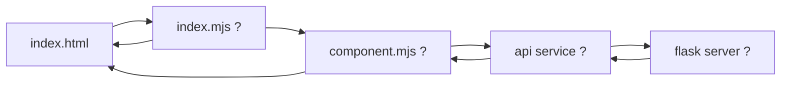

+++
title = "Understanding legacy code"
time = 60
emoji= "🗿"
[objectives]
    1="Explain the functionality offered by existing code"
    2="Sketch the flow of a request through existing code"
    3="Map the architecture of an unfamiliar application"
    4="Identify key components and their relationships"
    5="Build a mental model of request flow"
+++

> Understanding legacy code is like exploring an unfamiliar city. You need a map, some landmarks, and a way to navigate between points of interest.

The goal isn't just to find your way around, but to understand the city's design principles so you can build more of it. Get out your notebook and start drawing out a map of the application as you explore the codebase. You can sketch it in any way that makes sense to you. You are going to:

1. **Find the Entry Points**

   - Where does execution begin?
   - What routes are available: URLs, API endpoints, main routes

2. **Identify Core Components**

   - Frontend: Key UI elements, event handlers
   - Backend: Controllers, models, services
   - Database: Schema, relationships

3. **Trace the Request Flow**

   - Follow a single request from start to finish
   - Example: User login → route → authentication → database → response

4. **Map Data Structures**
   - What objects or data types are being passed around?
   - How is state managed?
   - How do we know who the user is?

### 🧑‍🎓 Activity: Application Archaeology

Open the PurpleForest application. Without making any changes yet, spend 15 minutes exploring to answer these questions:

1. What are the main components of the application?
2. How are the frontend and backend connected?
3. How is user data stored and retrieved?
4. Draw a simple diagram showing the flow of a bloom from creation to display

Remember, understanding comes before changing. Don't dive into fixing yet! Your goal is to understand the existing patterns so you can work effectively within them, not to reimagine the application architecture.
