+++
title = "Understanding legacy code"
time = 60
emoji= "🗿"
[objectives]
    1="Sketch the flow of a request through existing code"
    2="Identify key components and their relationships"
    3="Map the architecture of an unfamiliar application"
+++

> Understanding legacy code is like exploring an unfamiliar city. You need a map, some landmarks, and a way to navigate between points of interest.

```mermaid
flowchart LR
    A[🚪 index.html
    index.mjs]
    A --> B[📍 component.mjs
    component.spec.mjs
    component.css]
    B --> C[🚏 api service ?]
    C --> D[🧰 flask server ?]
    D --> C
    B --> A
    C --> A


```

### Fear

> Into the unknown

Do you remember your first day at ? You couldn't find the building, maybe, and you had no idea how the day would go. What on earth is a day plan, or a backlog, you thought to yourself. Perhaps you got frustrated: WHY are all my changes from last week in my new PR? HOW? It was incomprehensible. But you learned! You asked questions, you read the guides, and you built a mental map of the system.

So recognise that fear of the unknown. That feeling that if you change something, you don't know what will happen: that you will break things and not be able to fix them. It's a normal feeling, but it's not a reason to avoid the challenge.

### Patterns

> define design patterns

The first thing to do is to start identifying the patterns you can see and relate them to things you already know.

Get out your notebook and start drawing out a map of the application as you explore the codebase. You can sketch it in any way that makes sense to you. You are going to:

1. **Find the Entry Points**

   - Where does execution begin?
   - What routes are available: URLs, API endpoints, main routes

2. **Identify Core Components**

   - Frontend: Key UI elements, event handlers
   - Backend: Controllers, models, services
   - Database: Schema, relationships

3. **Trace the Request Flow**

   - Follow a single request from start to finish
   - Example: User login → authentication → database → response?

4. **Map Data Structures**
   - What objects or data types are being passed around?
   - How is state managed?
   - How do we know who the user is?

### Tests

### 🧑‍🎓 Activity: Application Archaeology

Open the PurpleForest application. Without making any changes yet, spend 15 minutes exploring to answer these questions:

1. What are the main components of the application?
2. How are the frontend and backend connected?
3. How is user data stored and retrieved?
4. Draw a diagram showing the flow of a bloom from creation to display

Remember, understanding comes before changing. Don't dive into fixing yet! Your goal is to understand the existing patterns so you can work effectively within them, not to reimagine the application architecture.
