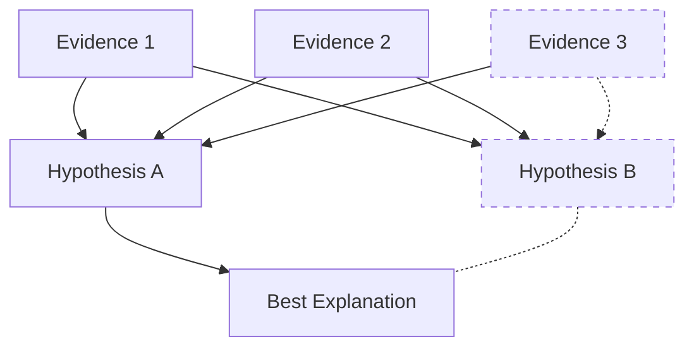

+++
title = "Abduction"
time = 60
emoji= "🔎"
[build]
render = 'never'
list = 'local'
publishResources = false
[objectives]
1="Define abduction"
2="Use evidence to reason to the best explanation"
+++

> Abduction is reasoning to the best explanation for all the evidence we observe

In [Sherlock Holmes: Consulting Detective](https://www.spacecowboys.fr/case3-the-murderess), we think like detectives. Each case presents us with mysterious evidence that needs explaining. Unlike deduction which proves only what _must_ be true, or induction which only finds patterns that are probably true, abduction seeks the most complete explanation.

> _Given_ a woman was found dead in her apartment  
> _And_ her jewelry was untouched  
> _And_ there were no signs of forced entry  
> _Then_ the killer likely knew the victim (but we can't be certain)

Each lead we follow adds new evidence. A witness statement might support our theory, contradict it, or suggest a completely different explanation. We must:

- Keep track of all evidence
- Form multiple possible theories
- Test each theory against _all_ the evidence
- Choose the explanation that best fits everything we know
- Be ready to revise our theory when new evidence appears

It's quite a lot like problem solving we've done before, isn't it? Now go solve a case:


