+++
title = "Abduction"
time = 30
[build]
render = 'never'
list = 'local'
publishResources = false
[objectives]
1="Define abduction"
2="Use evidence to reason to the best explanation"
+++

> Abduction is reasoning to the best explanation for all the evidence we observe

```mermaid
flowchart TD
   ev1[🟨 Yellow S] --> h1[Hypothesis LAPSE]
   ev2[🟨 Yellow A] --> h1
   ev3[🟩 Green E] --> h1
   ev1 --> h2[Hypothesis SHAME]
   ev3 --> h2
   h1 --> be[Best Word]
   style h2 stroke-dasharray: 5 5
```

Unlike deduction which proves only what _must_ be true, or induction which only finds patterns that are probably true, abduction seeks the most complete explanation.

> _Given_ we guessed STARE  
> _And_ we got 🟨⬜🟨⬜🟩  
> _Then_ LAPSE might be the answer (but we can't be certain)

In Wordle, we think like word detectives. We have an initial constraint: it must be an English word of five letters.

We have five attempts. Each guess we make gives us some feedback and allows us to eliminate some hypotheses, or guesses. A yellow square might support our theory about which letters are in the word, contradict it, or suggest a completely different explanation. We must:

- Keep track of all feedback squares
- Form multiple possible word theories
- Test each word against _all_ the evidence
- Choose the word that best fits everything we know
- Make a guess even though we can't know for sure whether we're right
- Revise our guess when new evidence appears

It's quite a lot like problem solving we've done before, isn't it? This process of seeking the best explanation mirrors how we approach complex problems in many fields:

🧑🏽‍⚕️ Doctors diagnosing illnesses from symptoms  
🕵🏿 Detectives solving cases from clues  
🧑🏿‍🔬 Scientists developing theories from observations  
🧑🏻‍🔧 Engineers troubleshooting system failures

We need a strategy, but experience also matters. In Wordle, the more English words we know, and the more we know about words, the better our guesses. In engineering, the more we know about building software, the faster we can find our problems.

Now go solve today's puzzle:


