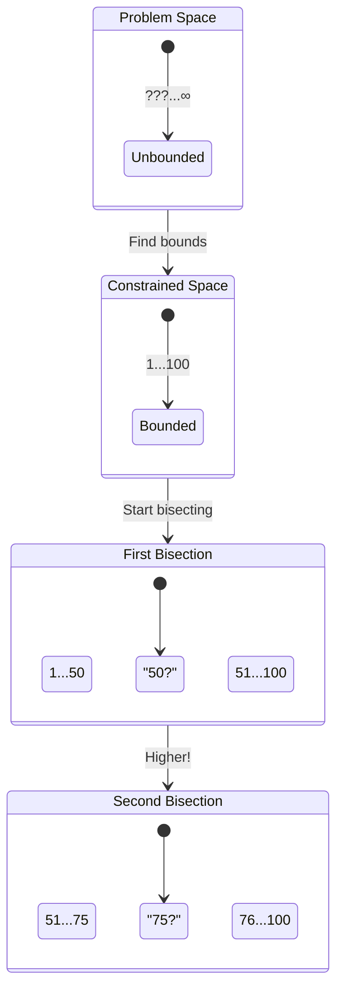

+++
title = "Bisection"
time = 10
emoji= "✂️"
[build]
  render = 'never'
  list = 'local'
  publishResources = false
[objectives]
    1="Define bisection"
    2="Identify problem constraints"
+++

> Bisection is a problem-solving strategy where we first identify the bounds of our problem, then repeatedly **reduce** that constrained space down to the answer

In Higher Lower games, our first step is identifying our constraints - what's the lowest and highest possible number? Once we have these bounds, we can use bisection effectively. For example:

> _Given_ the number must be between 1 and 100  
> _And_ it must be a whole number  
> _Then_ we have a constrained space of 100 possibilities  
> _So_ we can start our bisection at 50

Without first identifying these constraints, we wouldn't know where to start or when we're done. Imagine trying to play if the number could be any value - even negative or decimal numbers! Constraints turn an impossible problem into a solvable one.

Practice both constraining problems and bisection by playing Higher Lower:

1. First identify the bounds (What's the lowest possible? Highest possible?)
2. Then start in the middle of your constrained range
3. Keep track of your new bounds after each guess
4. Choose the middle of your remaining range each time


