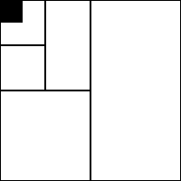

+++
title = "Bisection"
time = 10
[build]
  render = 'never'
  list = 'local'
  publishResources = false
[objectives]
    1="Define bisection search"
    2="Apply binary search to guess a number"
+++

> In bisection, we start with a large problem space and cut it in half with each guess.

In software development, bisection helps us find exactly when a change occurred. For example:

> _Given_ our code worked last week but not today  
> _When_ we test the middle version and it works  
> _Then_ the problem must be in the newer half

With each test, we:

1. Select the middle version
2. Test if it works
3. Eliminate half the versions
4. Repeat until we find the exact change

This [binary search](https://www.khanacademy.org/computing/computer-science/algorithms/binary-search/a/binary-search) technique is remarkably efficient. Even with thousands of versions, we'll find the problematic change in just a few tests. Git and other version control systems include [built-in bisect tools](https://git-scm.com/docs/git-bisect) for this purpose.


