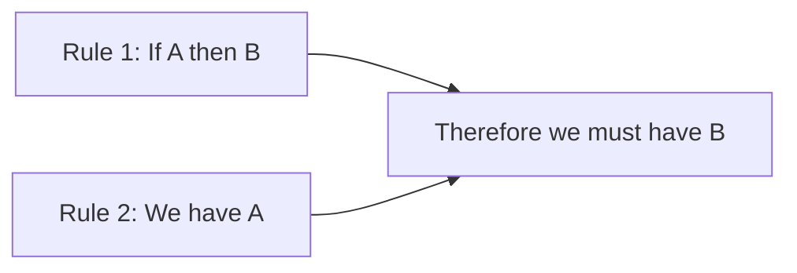

+++
title = "Deduction"
time = 25
[build]
  render = 'never'
  list = 'local'
  publishResources = false
[objectives]
    1="Define deduction"
    2="Use deduction to solve a matrix puzzle"
+++

> Deduction is reasoning from **general** rules to a **specific** conclusion that is _definitely_ true

In [Murdle](https://murdle.com/), we use deduction to solve murders. Given general rules about the crime scene and specific clues, we can Use rules you know are true to prove something specific _must_ also be true. who the murderer must be.

> _Given_ the body was found in the kitchen  
> _And_ only Miss Saffron had been in the kitchen  
> _Then_ Miss Saffron must be the murderer

This is deduction: starting with general rules and arriving at a specific conclusion that must be true. Unlike guessing or inferring patterns, deduction gives us certainty. If our premises are true, our conclusion must be true.

In Murdle, every puzzle can be solved through pure deduction. There's no need to guess. The clues and rules will lead you to a single possible murderer.

Go play Murdle.


