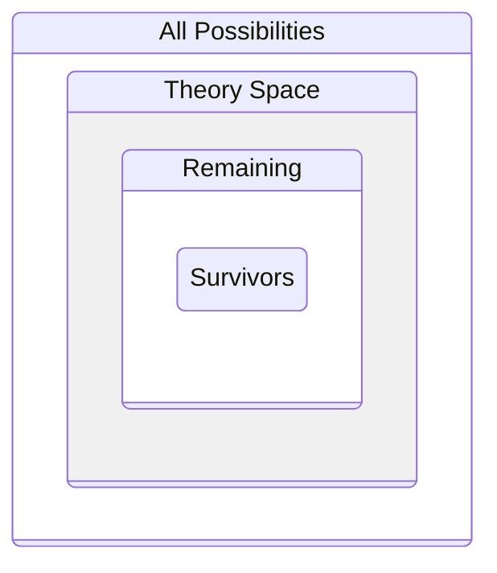
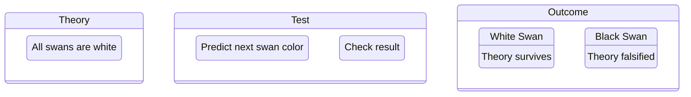

+++
title = "Falsification"
time = 25
emoji= "❌"
[build]
  render = 'never'
  list = 'local'
  publishResources = false
[objectives]
    1="Define Popper's falsification principle"
    2="Use elimination to reduce possibilities"
+++

> Falsification is a _reduction_ strategy. It means making predictions that eliminate possibilities, rather than gathering evidence that supports them

Disconfirmation is the mental model we must build here. In [Zendo](https://www.looneylabs.com/games/zendo), we discover the rule governing pyramid patterns not by _confirming_ our guesses, but by _eliminating_ what's impossible:

> _Given_ many possible rules  
> _Make_ a prediction that could eliminate some  
> _When_ the prediction fails  
> _Then_ we can discard those possibilities

Here's a [classic example](https://simple.wikipedia.org/wiki/Falsifiability):

This strategy shows us that:

1. Only gathering confirming evidence leaves too many possibilities, or too large a problem domain
2. However, each failed prediction narrows our search space
3. We learn _more_ from being wrong than being right

Now, practice eliminating possibilities in [Zendo](https://www.koryheath.com/zendo/). For this game you need a group, so post in Slack to find others to play with.


