+++
title = "Falsification"
time = 45
[build]
  render = 'never'
  list = 'local'
  publishResources = false
[objectives]
    1="Define Popper's falsification principle"
    2="Use elimination to reduce possibilities"
+++

> Falsification is an efficient _reduction_ strategy. It means making predictions that **eliminate** possibilities, rather than gathering evidence that supports them



<--->

> _Given_ many possible rules  
> _Make_ a prediction that could eliminate some  
> _When_ the prediction fails  
> _Then_ we can discard those possibilities



This is a subtle distinction: _dis_ confirmation is the mental model we must build here. In 20 Questions we discovered our problem space by confirming _and_ disconfirming our guesses. In [Zendo](https://www.looneylabs.com/games/zendo), we will try to discover the rule governing pyramid patterns not by _confirming_ our guesses, but by _eliminating_ what's impossible

Here's a [classic example](https://simple.wikipedia.org/wiki/Falsifiability):

```mermaid
flowchart TD
    T["🦢 Theory: All Swans Are White"]
    O["Observe Next Swan"]
    D{"What Color?"}
    W["Theory Holds..."]
    F["Theory Falsified!"]

    T --> O
    O --> D
    D -->|⬜ White| W
    D -->|⬛ Black| F
    W -->|"Keep testing"| O

```

[Popper](https://en.wikipedia.org/wiki/Falsifiability) explains that each additional white swan appears to confirm our wrong idea that all swans are white. A single black swan disproves it, and ends the loop. This strategy shows us that:

1. Only gathering confirming evidence leaves too many possibilities, or too large a problem domain
2. However, each failed prediction narrows our search space by discarding possibilities
3. We learn _more_ from being wrong than being right

It is more efficient to find a way to disprove your hypothesis or falsify your proposition, if you can. This is because you only need to disprove something once to discard it, but you may apparently verify a hypothesis many times in many different ways and still be wrong.

Now, practice eliminating possibilities in [Zendo](https://www.koryheath.com/zendo/). For this game you need a group, so post in Slack to find others to play with.


