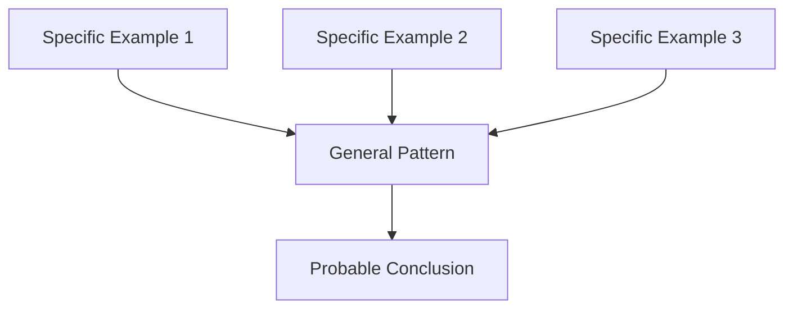

+++
title = "Induction"
time = 45
[build]
  render = 'never'
  list = 'local'
  publishResources = false
[objectives]
    1="Define induction"
    2="Use induction to form general theories about the best strategies in Sushi Go"
+++

> Induction is reasoning from **specific** examples to form **general** patterns that are _probably_ true

In Sushi Go, we use induction to build winning strategies. By observing specific outcomes across multiple hands, we form general theories about what works. For example:

> _Given_ collecting 3 tempura scored 10 points  
> _And_ collecting 2 tempura scored 5 points  
> _And_ collecting 1 tempura scored 0 points  
> _Then_ tempura probably works best in pairs

Unlike deduction which gives certainty, induction helps us form educated guesses about patterns. The more examples we see, the more confident we can be in our general conclusions - but we can never be 100% certain.

In [Sushi Go](https://en.boardgamearena.com/gamepanel?game=sushigo), every game teaches us something new about card combinations, timing, and player behavior. Through repeated play, we inductively learn strategies like:

- Watching what others collect helps predict what cards will come around
- Early puddings often pay off in the final round
- Chopsticks are most valuable when saved for high-scoring combinations

Play a few rounds of [Sushi Go](https://en.boardgamearena.com/gamepanel?game=sushigo) and practice inductive reasoning. Don't spend a long time reading the rules, just play through a few rounds to get the idea. Try to:

1. Notice specific scoring patterns
2. Look for recurring situations
3. Form general theories about good strategies


