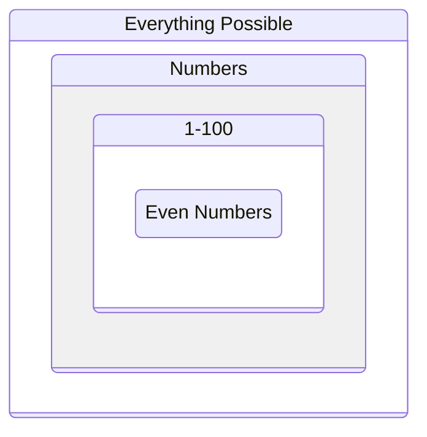

+++
title = "The Problem Domain"
time = 10
emoji= "🗺️"
[build]
  render = 'never'
  list = 'local'
  publishResources = false
[objectives]
    1="Define the problem domain"
    2="Learn to constrain problems before solving them"
+++

> The problem domain is a bounded space that contains all possible solutions to a problem. Everything outside the problem domain is impossible or irrelevant.

<figure>

<figcaption>Each constraint reduces our problem space</figcaption>
</figure>

Before we can solve a problem, we need to understand what's possible. In [Twenty Questions](http://20q.net/):

> _Given_ no constraints  
> The answer could be anything in the universe!  
> _When_ we add "must be an animal"  
> We constrain to a manageable domain

Understanding our problem domain means:

1. Starting with everything possible
2. Adding constraints one by one
3. Reaching a bounded space we can search
4. Only then starting to solve


