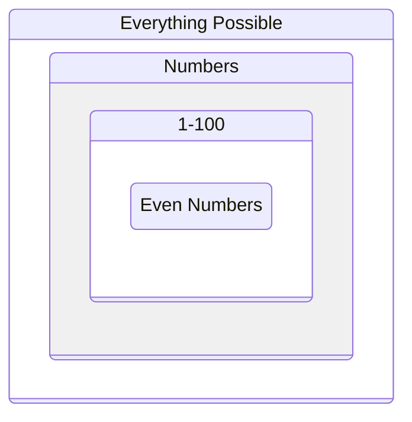

+++
title = "The Problem Domain"
time = 15
[build]
  render = 'never'
  list = 'local'
  publishResources = false
[objectives]
    1="Define the problem domain"
    2="Learn to constrain problems before solving them"
+++

> The problem domain is a bounded space that contains all possible solutions to a problem. Everything outside the problem domain is impossible or irrelevant.



<figure>

<figcaption>Each constraint reduces our problem space</figcaption>
</figure>

<--->

> _Given_ no constraints  
> _Then_... the answer could be anything in the universe!  
> _When_ we add "must be a number"  
> _Then_ we constrain to the domain of numbers



Before we can solve a problem, we need to understand what's possible. In [Twenty Questions](http://20q.net/) we start with everything in the universe, then ask questions to reduce our problem space. We might start with "Is it alive?" to constrain our domain to animals, then "Is it a mammal?" to reduce further.


