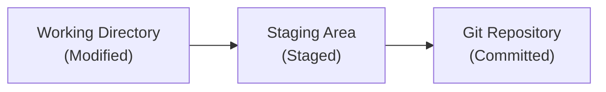
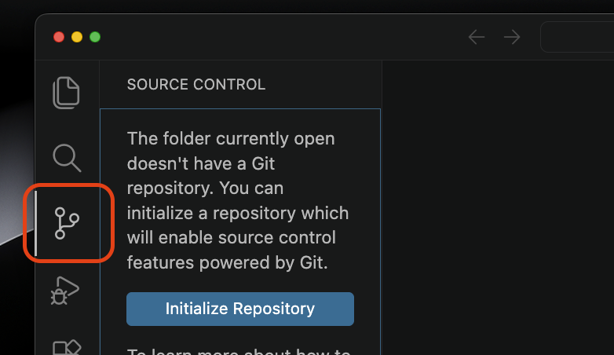
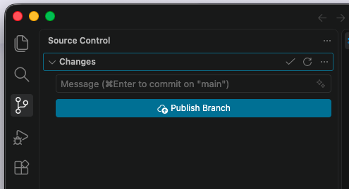
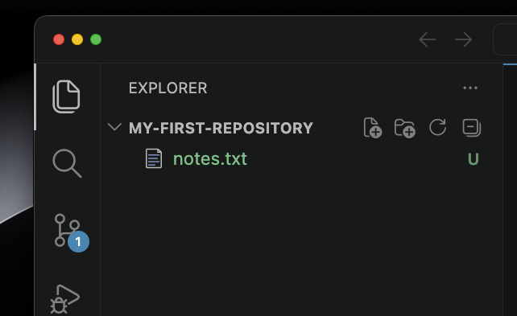
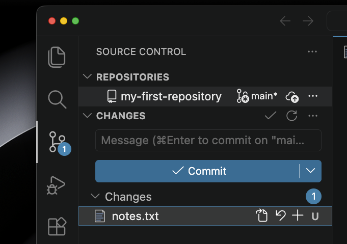
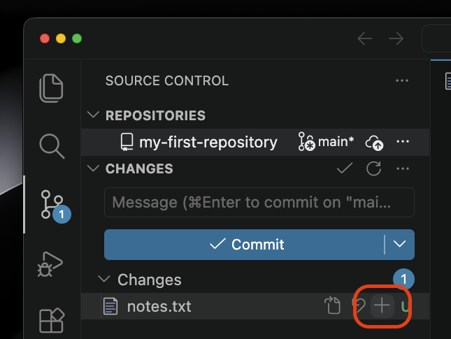
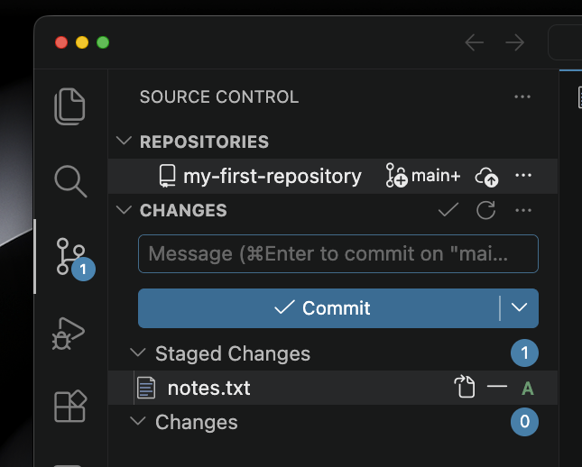
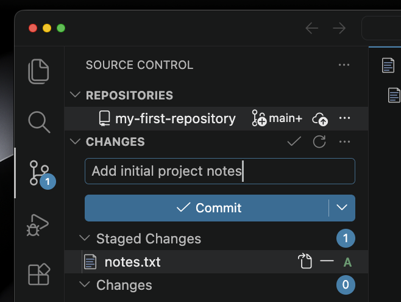
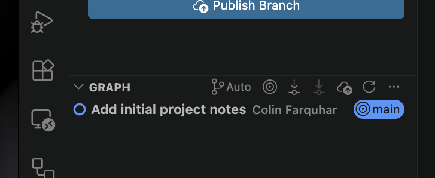

+++
title = 'Creating a Commit'
time = 45
objectives = [
    "Use Git to identify which files have been changed",
    "Selected files to be included in a commit",
    "Create a commit"
]
hide_from_overview = true
[build]
  render = 'never'
  list = 'local'
  publishResources = false

+++

A **commit** is a saved version of your project at a particular moment in time. Think of it like saving a document, but with a detailed message explaining what changed and why.

### Understanding the Three States

Git has three states for your files:

1. **Modified** - You changed the file, but haven't saved the version yet
2. **Staged** - You've marked the file as ready to be saved
3. **Committed** - The file is now saved in Git history



### Step 1: Create a New Repository

A repository is a folder where Git tracks all your files and their changes.

1. Create a new folder for your project called `my-first-repository`.

2. Open the folder in VSCode. In VSCode, go to `File` > `Open Folder...` and choose your `my-first-repository` folder. Make sure you open the folder itself, not a file inside it. You should see the folder name at the top of the Explorer tab.

3. We're going to **initialise a Git repository** in this folder. Open the `Source Control` tab on the left of the VSCode window (highlighted red in the screenshot below) then click the `Initialize Repository` button.




If the Source Control tab only shows an `Open Remote Repository` button, VSCode is not able to use Git in your folder yet. Check these things in order:

1. **Is a folder open?** If you opened a file instead of a folder, or nothing at all, go to `File` > `Open Folder...` and open `my-first-repository`.
2. **Can VSCode find Git?** Open a terminal and run `git --version`. If you get an error instead of a version number, go back to the Check Git Installation section and install Git.
3. **Restart VSCode.** If you installed Git while VSCode was open, VSCode will not know about it until you fully quit and reopen it.

If you still can't see the button, post a screenshot of your Source Control tab in Slack and ask for help.


The tab should now look like this:



### Step 2: Create a File and Make Changes

Let's create a simple text file:

1. Create a new file called `notes.txt` in your `my-first-repository` folder.
2. Add some text:
   ```console
   My First Git Project
   
   Today I'm learning Git!
   This is my first commit.
   ```
3. Save the file

### Step 3: Check the Status of Your Repository

Let's see what's changed in VSCode after adding our file. The first thing you will notice is that our file name is now green with the letter U next to it:



We also now have an icon on the source control tab. If we click there we can see our file is listed here too:



The green U means our file is **untracked**. 

Git is saying: "I see a file called `notes.txt`, but you haven't told me to track it yet."

### Step 4: Stage Your Changes

Now we tell Git we want to save this version of the file. This is called **staging**. When you hover your mouse over the file name a plus symbol will appear:



Click the button and the file will move to a new section called `Staged Changes`:



The letter has changed to an A for **added** too. Git is saying: "I'm ready to save this file."

### Step 5: Create Your First Commit

It's time to make our first commit and save this version of our file into our Git history. In the text box in the source control tab we can enter a **commit message**. The message describes what we changed. Add the text "Add initial project notes" then click the "Commit" button to make our first commit!




Write messages that explain **what** you changed and **why**:
- ✅ Good: "Add login button to homepage"
- ✅ Good: "Fix bug where users can't save files"
- ❌ Avoid: "stuff", "changes", "update"

Keep messages short but clear (under 50 characters is ideal).


### Step 6: View Your Commit History

VSCode has a tool which lets us see the messages attached to every commit in our repository. Scroll down to the "graph" section of the page to see it.



You should see your commit with:
- Your name
- Your commit message
- The word `main` next to it. This is the **branch** of our repository we are working on and we'll explain more about this in the next sprint.

You can click on a commit message to display a list of the files it changed underneath.

### Workflow Summary

Here's the complete workflow for making commits:

1. **Modify files** in your editor
2. **Stage changes** in the source control tab
3. **Create commit** with a meaningful message



1. Create a new file called `planning.txt`
2. Add some text to it
3. Save it
4. Stage your changes
5. Make a commit with the message `"Add project planning document"`
6. Check the history to see both commits



