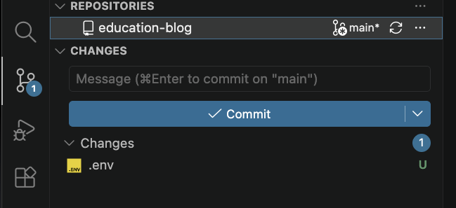
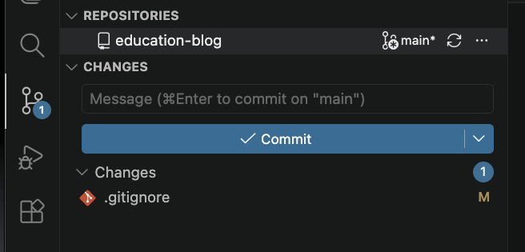

+++
title = 'Ignoring Files'
time =45
[objectives]
    1="Use a .gitignore file to avoid tracking a file"
[build]
  render = 'never'
  list = 'local'
  publishResources = false

+++

TODO:

- Create an additional file in a repo - **do not commit**
- Explain why we may not want to commit it
- Create `.gitignore`
- Use `git status` (or equivalent in VSCode) to show file is being ignored

We can avoid situations like our password mistake if we tell Git not to pay attention to files containing sensitive data in the first place. First of all we're going to delete `passwords.json` as this isn't typically how we would store this data. Instead create a file called `.env` and copy the values there instead.

```sh {title=".env"}
  DB="storage_is_awesome"
  APIKEY="acbd1234"
```

The `.env` file will store **environment variables**. These typically hold values necessary to configure parts of our application and by following convention in how we store them we minimise the risk of issues when we deploy an application.

At the moment we have `.env` waiting for staging, but if we create a commit we will have exactly the same problem as in the last section. How can we avoid accidentally committing our passwords?

### Using `.gitignore`

Let's take a look at the state of our Git repository. Currently the source control tab shows one unstaged change - our new `.env` file.



Now look for a file called `.gitignore` in the directory and open it. At the moment it only has one line:

```sh {title=".gitignore"}
node_modules
```

We will learn more about `node_modules` later in the course, for now we are going to add our `.env` to this file to prevent Git tracking it.

```sh {title=".gitignore"}
node_modules
.env
```

Save the changes and take another look at the source control tab:



Still only one change, but now it's a different file! What just happened?

The `.gitignore` file does exactly what its name suggests - it tells Git to **ignore** any files or folders we list inside it. Once we added our `.env` file Git stopped paying attention to it, so the changes stopped showing up in our source control tab. We can now add anything we like to `.env` and Git won't care.

Developers often use `.gitignore` files to avoid adding unnecessary files to a repository. For example, if you personalise your VSCode workspace it will create a `.vscode` folder in your working directory, but that doesn't need to be tracked by Git. 

Any type of file can be added to a `.gitignore` file and we can do some complex pattern matching in them. The [official documentation](https://git-scm.com/docs/gitignore) has a breakdown of how to structure these files.