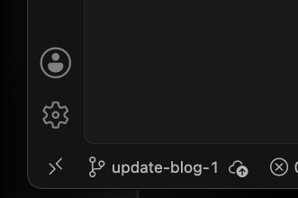
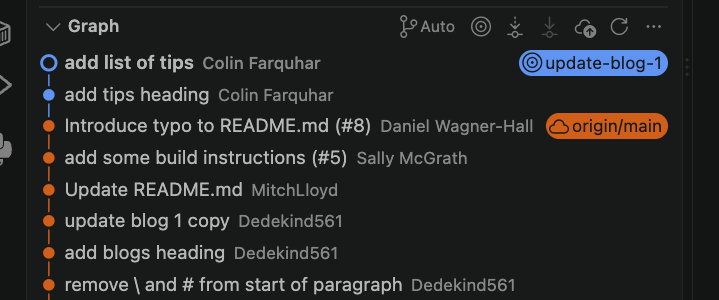
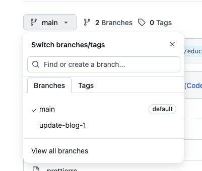
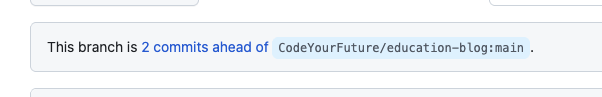
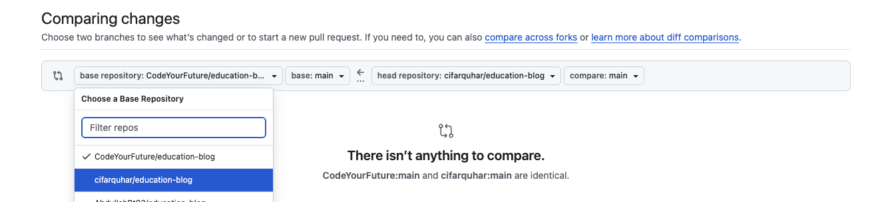
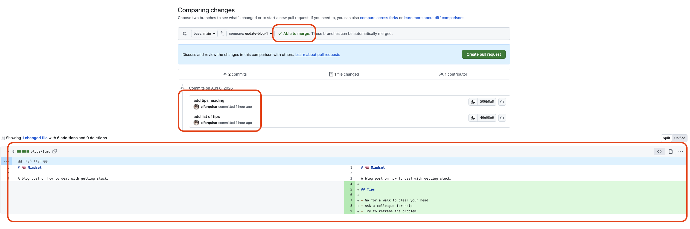
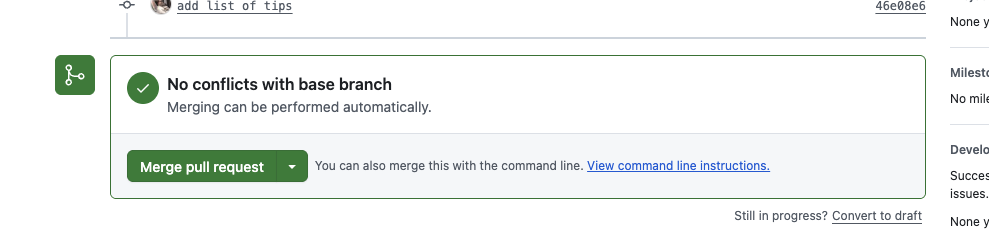

+++
title = 'Merging'
time =45
[objectives]
    1="Push a branch to GitHub"
    2="Create a pull request"
    3="Merge a pull request to `main`"
[build]
  render = 'never'
  list = 'local'
  publishResources = false

+++

If you have successfully created a new branch you will see that it is now displayed instead of `main` in the bottom left of the VSCode window:

It's time to make some changes!


1. Add an `h2` heading to the blog with the title "Tips"
2. Commit your change
3. Add an unordered list with three tips for getting un-stuck. Try Google if you need some ideas!
4. Make another commit with your list

Remember: This is a markdown file so your heading and list will need to use markdown syntax. [This cheat sheet](https://www.markdownguide.org/cheat-sheet/) will help if you get stuck.


Now we have made changes we can check our Git history and see the commits listed there. Something is different this time, though:

The commits we made on the branch are a different colour to those on `main` (your colours may not be the same as mine). This can be really helpful when we are tracking changes through a project.

We need our work to be on GitHub to share with our colleagues. We can push a branch in the same way as we push to `main` by clicking the "publish branch" button.

### Branches on GitHub

When we look at the repository on GitHub we can see something has changed here too. It now says we have two branches and clicking on the branch name opens a drop-down listing all the branches which have been pushed. For now it's just our `update-blog-1` branch.

Click `update-blog-1` in the list and the UI will update to show our files as they are on the branch. 


Use the UI to navigate to the file we just edited. Can you see the changes we made?


We also see a summary of the difference between our branch and `main` at the top of the page:

When we see a message like this saying our branch is "`N` commits ahead" it means there is work on our branch which isn't available on `main`. We need to **merge** our work with the rest of the project.

### Creating a pull request

When we merge our work we will combine our commits with those on the branch we are merging to. In this example we will take commits from `update-blog-1` and **merge them onto** `main`. 

GitHub has tools which will help us manage this process. We're going to create a **pull request** and see how it will help us.

Click the "Pull requests" tab then the green "New pull request" button. The next page will say there is nothing to compare, but that's because by default it won't be looking at our changes. Instead it will try to compare the `main` branch of our fork with the `main` branch of the original repository and neither of them have changed.

Click the left drop-down and select your fork of the repository. 


You will skip this step when submitting work from your backlog. Unless the instruction say otherwise you will **always** set the base of your pull request to be the CYF repo you created the fork from.

We are doing things differently here to demonstrate the complete merging process. If everyone tried to merge the same changes to the original repository it would cause problems.


The UI still tells us there are still no changes to compare. Let's fix that by selecting a branch to compare. In the right-hand drop-down select your `update-blog-1` branch and the UI will change:

There are a couple of things to note here:

- GitHub tells us it is **able to merge automatically**. This won't always be the case, but we'll look at how to handle that in a later workshop.
- We can see a list of all the commits we are about to merge
- We see a display of all the changes which will be made to the files. We are only adding content here so everything is highlighted green. If we were deleting lines they would be highlighted in red.

Click the "create pull request" button to move to the next stage. Here we can give our pull request a title and a description. Every organisation has it's own way of structuring these and CYF is no different. You can find [instructions for how to title a pull request in the guides section](/guides/reviewing/trainee-pr-guide/).

For now we'll leave the defaults in place since this is just a practice pull request. Click the green button to finish creating it.

### Merging

Now we have created a pull request and we're ready to merge our work. In a typical professional workflow you would ask a senior colleague to review your work before merging. We will follow a similar process with the work you submit for CYF: a volunteer will review your pull requests and give you feedback on your code.

In a future workshop we will spend more time exploring the interface but for now we'll concentrate on the box in the middle of the page:

Clicking the green button will open a form asking for a commit message. Typically we can leave this as the default value. When we finalise the merge a new commit will be created on `main`, just like for any other change we make to the code. Click "confirm merge" to complete the process.


The prompt told us there were "no conflicts with the base branch". We won't always be able to merge our work so easily, sometimes another engineer will have made changes to the same files as us. When this happens Git isn't able to figure out which change takes priority and a **merge conflict** occurs.

You shouldn't come across this while submitting work. If you do post a message on Slack and get help to resolve it. We will look at merge conflicts in detail in a future workshop.


Navigate back to the "code" tab in GitHub and make sure you are viewing the `main` branch. Take a moment to explore the files - our changes are now on `main`! 

Now it's time to put our new skills to work!