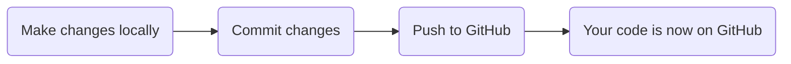

+++
title = 'Pushing and Pulling'
time ="30"
objectives = [
    "Link local and remote repositories",
    "Upload files to GitHub"
]
hide_from_overview = true
[build]
  render = 'never'
  list = 'local'
  publishResources = false

+++

TODO:

- Add a remote in VSCode
- Push commits
- Explain that we can retrieve code from GitHub with `git pull` but leave example for a later module


Now that your local and remote repositories are connected, you need to learn how to synchronize them. **Pushing** sends your local commits to GitHub, and **pulling** gets updates from GitHub.

### The Git Workflow



### Step 1: Push Your Commits to GitHub

You have commits on your local machine, but they're not on GitHub yet. Send them using the "Publish Branch" button.


This is called **pushing**. We don't need to push every time we commit, but our colleagues won't be able to access it if we don't.

You might be asked to authenticate. Follow GitHub's instructions. Depending on how you linked the repositories you may be able to authenticate using SSH instead of entering a username and password.


The **Secure Shell Protocol** (SSH) enables encrypted connections between two computers. We recommend taking the time to [configure SSH with GitHub](https://docs.github.com/en/authentication/connecting-to-github-with-ssh) which will avoid the need to keep entering passwords when pushing and pulling.


### Step 2: View Your Code on GitHub

1. Go to your repository on GitHub (https://github.com/YOUR-USERNAME/my-first-project)
2. You should see your files!
3. Click on a file to view its contents
4. Click the "History" button (clock icon) to see commits

Congratulations! Your code is now on GitHub and you have a portfolio piece! 🎉

### Step 3: Make Changes and Push Again

The workflow for subsequent changes is simpler:

1. Modify a file (e.g., add more text to `notes.txt`)
2. Commit the change:
   ```
   git add notes.txt
   git commit -m "Update project notes"
   ```
3. Push to GitHub:
   ```
   git push
   ```

That's it! Your changes are now on GitHub.


1. Open `planning.txt` in VSCode
2. Add more content to it
3. Save the file
4. Run: `git add planning.txt`
5. Run: `git commit -m "Expand project planning"`
6. Run: `git push`
7. Go to GitHub and refresh to see your changes!


### Understanding Push and Pull

#### Push (Send to GitHub)

```
Your Computer (local)        GitHub (remote)
     Commits        ──push──→    Commits
                                (backup)
```

When you push, GitHub gets a copy of your commits.

#### Pull (Get from GitHub)

```
Your Computer (local)        GitHub (remote)
     Commits        ←─pull────    Commits
                            (updates)
```

When you pull, you get any commits that were made on GitHub (or by teammates).


In a team project, other developers might push commits to GitHub. You need to pull regularly to keep your local copy up to date.


### Complete Workflow Example

Here's a day in the life of a developer:

```
Morning:
1. git pull          (get latest from team)

During the day (multiple times):
2. Make changes
3. git add .
4. git commit -m "description"
5. git push          (share with team)

Before leaving:
6. git push          (make sure everything is saved)
```

### Troubleshooting

**"Nothing to push"**
You have no new commits. This is fine! It means your local and remote are in sync.

**"Rejected"**
This usually means someone else pushed changes. Run `git pull` first, then `git push`.

**"Permission denied"**
Check that you're logged into the right GitHub account.

### Common Commands

| Command      | What it does                          |
| ------------ | ------------------------------------- |
| `git push`   | Send commits to GitHub                |
| `git pull`   | Get commits from GitHub               |
| `git status` | Check if local and remote are in sync |
| `git log`    | See all commits                       |
| `git fetch`  | Check for updates without merging     |

### The Complete Git Journey

You now know:
- ✅ How to configure Git
- ✅ How to make commits (save versions)
- ✅ How to connect to GitHub (remote)
- ✅ How to push commits to GitHub
- ✅ How to pull updates from GitHub

**You're ready to:**
- Build projects and track changes
- Share code with others
- Build a portfolio on GitHub
- Work in teams

### Common Mistakes to Avoid

1. **Forgetting to push** - Your commits are local only, not on GitHub
2. **Forgetting to commit** - You made changes but didn't save the version
3. **Wrong branch** - Always check you're on "main" with `git branch`
4. **Large files** - Don't commit videos, databases, or node_modules
5. **Secrets** - Never commit passwords or API keys

### What to Practice

1. Create 3-5 small projects locally
2. Push each one to GitHub
3. Make changes and push again
4. Get comfortable with the push/pull workflow

### Further Reading

- [Atlassian - Git Push](https://www.atlassian.com/git/tutorials/syncing/git-push)
- [Atlassian - Git Pull](https://www.atlassian.com/git/tutorials/syncing/git-pull)
- [GitHub Docs - Pushing Commits](https://docs.github.com/en/get-started/using-git/pushing-commits-to-a-remote-repository)
- [GitHub Docs - Pulling Changes](https://docs.github.com/en/get-started/using-git/getting-changes-from-a-remote-repository)
```