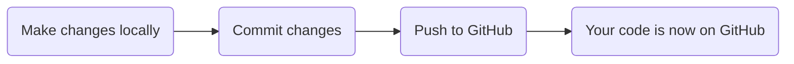
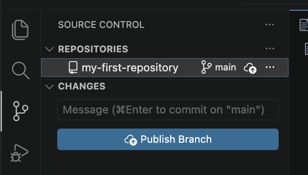
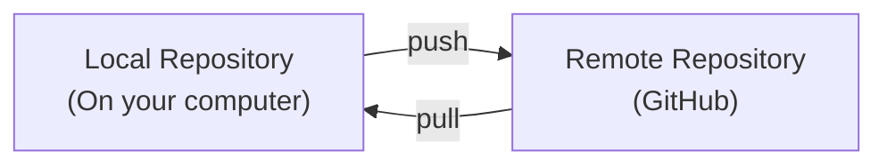

+++
title = 'Pushing and Pulling'
time = 30
objectives = [
    "Link local and remote repositories",
    "Push files to GitHub"
]
hide_from_overview = true
[build]
  render = 'never'
  list = 'local'
  publishResources = false

+++

Now that your local and remote repositories are connected, you need to learn how to synchronize them. **Pushing** sends your local commits to GitHub, and **pulling** gets updates from GitHub.

### The Git Workflow

### Step 1: Push Your Commits to GitHub

You have commits on your local machine, but they're not on GitHub yet. Send them using the "Publish Branch" button.

> If you don't see the "Publish Branch" button you can click the three dots again to access the menu and select "push"

This is called **pushing**. We don't need to push every time we commit, but our colleagues won't be able to access it if we don't.

You might be asked to authenticate. Follow GitHub's instructions. Depending on how you linked the repositories you may be able to authenticate using SSH instead of entering a username and password.

### Step 2: View Your Code on GitHub

1. Go to your repository on GitHub (https://github.com/YOUR-USERNAME/my-first-project)
2. You should see your files!
3. Click on a file to view its contents
4. Click the "History" button (clock icon) to see commits

Congratulations! Your code is now on GitHub and you have a portfolio piece! 🎉

### Step 3: Make Changes and Push Again

The workflow for subsequent changes is simpler:

1. Modify a file (e.g., add more text to `notes.txt`)
2. Stage and commit the change
3. Push to GitHub

That's it! Your changes are now on GitHub.


1. Create a file called `facts.txt` in VSCode
2. Add your favourite fun fact to the file
3. Save the file
4. Commit your changes
5. Add another fact. Commit this change.
6. Push to GitHub
7. Go to GitHub and refresh to see your changes!


### Understanding Push and Pull

Remember our diagram from the last section

When you **push** a copy of your commits is sent to GitHub. Your colleagues can now access them. Even though you don't need to push after every commit it is still important to do it regularly.

When you **pull** you get any commits that were sent to GitHub by your teammates. We will look at pulling in more detail in a later section.

### The Complete Git Journey

You now know:
- ✅ How to configure Git
- ✅ How to make commits (save versions)
- ✅ How to connect to GitHub (remote)
- ✅ How to push commits to GitHub

**You're ready to:**
- Build projects and track changes
- Share code with others
- Build a portfolio on GitHub

### What to Practice

1. Create 3-5 small projects locally
2. Push each one to GitHub
3. Make changes and push again
