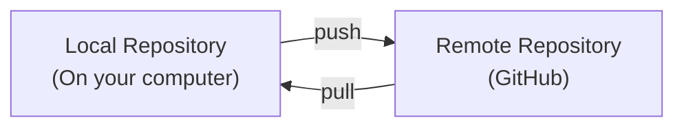
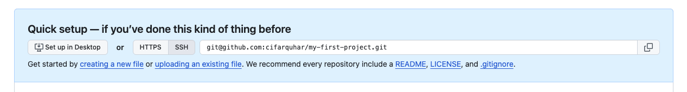
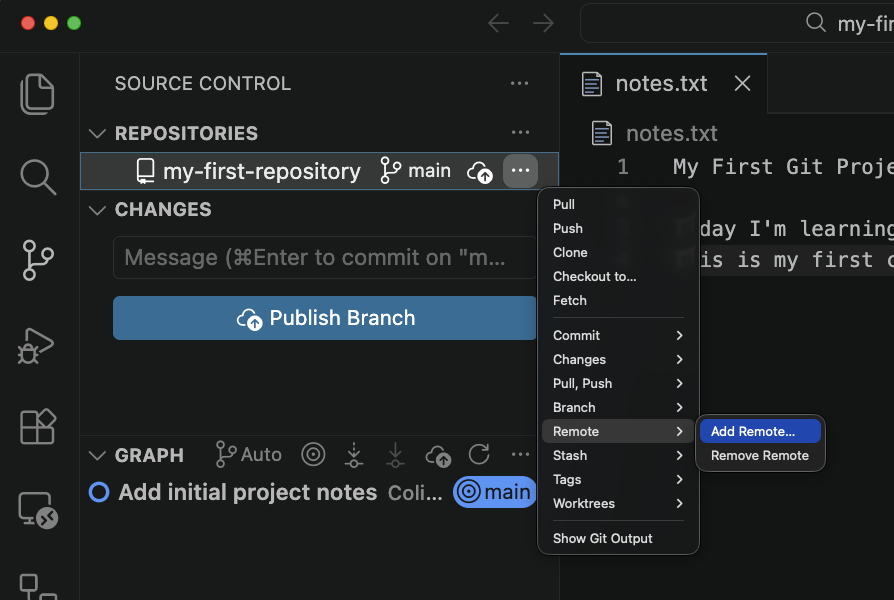
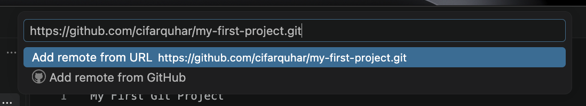
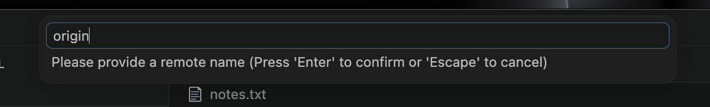

+++
title = 'Remote Repositories'
time ="20"
objectives = [
  "Understand what a remote repository is",
  "Create a new repository on GitHub",
  "Connect your local repository to GitHub",
  "Verify the connection"
]
hide_from_overview = true
[build]
  render = 'never'
  list = 'local'
  publishResources = false

+++

So far, our commits are saved on our computer. A **remote repository** is a copy of our project stored on a server (like GitHub), so others can access it and we have a backup.

### Why Use Remote Repositories?

1. **Backup** - Your code is safe on GitHub's servers
2. **Collaboration** - Other developers can access your code
3. **Portfolio** - Employers can see your work on your GitHub profile
4. **Team projects** - Work together on the same codebase

### Local vs Remote

### Step 1: Create a Repository on GitHub

1. Go to [https://github.com](https://github.com)
2. Click the **+** icon in the top right
3. Select **"New repository"**
4. Give it a name (e.g., `my-first-project`)
5. Add a description (optional)
6. Choose **"Public"** (so your portfolio is visible)
7. **Don't** initialize with README, .gitignore, or license
8. Click **"Create repository"**


If you initialize with files on GitHub, your local and remote repositories will be different, which causes conflicts. Since we already have commits locally, we'll connect them directly.


### Step 2: Add the Remote Connection

GitHub will show you a page with instructions. You need to tell your local Git about this remote repository.

First copy the url to your clipboard.

Then go back to VSCode's version control tab, expand the menu next to the repo name and go down to "remotes". Select "Add remote".

In the dialogue box which appears paste the url you copied from GitHub.

Finally give the remote a name. For now we will give it the name `origin`. We _could_ name it anything we like, but we will follow convention.

We have now linked our local repository with our GitHub repository!

#### Understanding "origin" and "main"

There are two terms we have seen now which are probably unfamiliar. Both are important and we'll learn more about why in the coming weeks.

- `origin` - The name used to refer to your remote repository (GitHub). 
- `main` - The name of your default **branch**. 


A branch is like an alternative version of your project. Most projects have a "main" branch (the stable version) and feature branches (experimental versions). For now, you'll only use "main".



A remote is a place we can upload our code to. We have already created our `origin` remote but we may also want to create others if we want to share our code somewhere else. For example, if we wanted to host a website on AWS we would need to create a remote there too.


### What's Next?

Now that your repositories are connected, you're ready to:
- **Push** - Send your local commits to GitHub
- **Pull** - Get updates from GitHub
- **Collaborate** - Work with other developers

