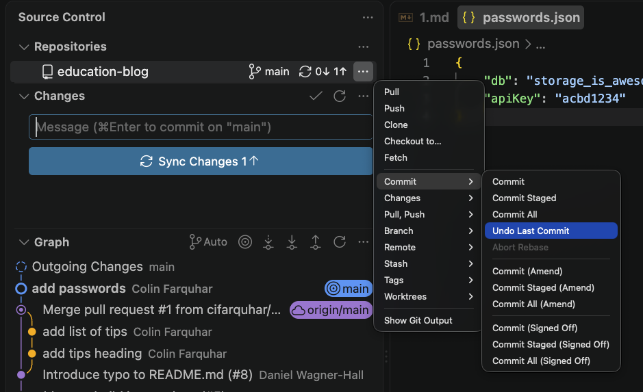

+++
title = 'Undoing a Commit'
time =45
[objectives]
    1="Undo a commit"
[build]
  render = 'never'
  list = 'local'
  publishResources = false

+++

One of the great things about Git is that it captures the complete history of a project. Because we know exactly what was changed with each commit we are able to deconstruct the changes made to a project and revert it to a previous state. We can jumping back and forth between versions if we need to see what our project looked like before some changes were made.

We can also _undo_ those changes, acting as if they never actually happened. This is particularly useful in a situation where we accidentally commit something we didn't mean to, which can easily happen!

### Undoing a commit

Let's revisit the [educational blog](https://github.com/CodeYourFuture/education-blog) we looked at in Sprint 1. Open the folder in VSCode and take a moment to refamiliarise yourself with the files.

Let's imagine a world where we're putting this page online using a platform like GitHub Pages. usually we need to include some sort of configuration information when we deploy an application, typically things like GitHub urls to load content from or passwords for third-party services. We're going to add a fake file which will store some credentials for our imaginary deployment.

Create a file called `passwords.json` at the directory's root and add the following object to it:

```json {title="passwords.json"}
{
  "db": "storage_is_awesome",
  "apiKey": "acbd1234"
}
```

We would usually want to make a commit at this point, so switch over to the source control tab and commit this new file.

We may have just made a mistake though. Things like passwords and API keys are typically personal to a particular user, do we want to share them with the entire team? What if our repository is public, do we want them visible to everyone on the internet? We need to undo this commit before our details get shared!

There are multiple ways of doing this with Git but not all are supported natively by VSCode's source control tools. In VSCode we can only undo the most recent commit but later we will see how to apply this to any commit.

Click the dots next to the repo name in the source control tab. From there click `Commit --> Undo Last Commit`.



After clicking the button you will see the changes made in the commit have been returned to staging. From here you can remove anything that shouldn't be there and commit again, or remove everything. The files themselves and the changes made are unaffected, it is only the commit which is deleted.

VSCode is fairly limited here - it can only undo the last commit. If another commit has been made since the one we want to undo we have a problem. Git does have functionality which enables us to undo any commit though, which we will look at in a later section. For now let's take a look at a way of avoiding this happening at all.
