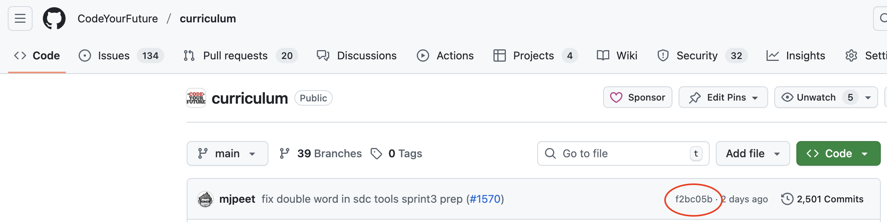

+++
title = "Project Submission"
time = 5
objectives = [
  "Describe how a Piscine project should be submitted.",
]
[build]
  render = "never"
  list = "local"
  publishResources = false
+++

For all projects in the Piscine:
* The project must be in its own repository. That repository must not contain other projects. Do not fork this `CodeYourFuture/The-Piscine` repo - make a new repository for your project.
  * There should not be any dead code or unused code in your repository. All code should be used, all tests should run and pass.
* For team projects, all members of the team should work in the same repository.
* There is some supplied scaffolding for all projects. You may copy this from [The Piscine repository](https://github.com/CodeYourFuture/The-Piscine). You should remove any content that doesn't apply when you use it (e.g. there shouldn't be any comments saying "This is an example" or "This is a placeholder").
* You are expected to write at least one non-trivial test for each project.
  * Non-trivial means that the test must test something that could go wrong, and matters to the project. So it a test which shows that calling `getUsers()` returns 5 users would not be non-trivial. But testing that, say, entries are sorted correctly before being presented to the user is non-trivial.
  * You are not required to test via the DOM. You may choose to. But you can pass the Piscine without writing a single test involving the DOM.
  * We will try running your tests by running `npm i && npm test`. This must run your tests and they must all pass. Make sure you're not relying on globally installed packages - someone on a fresh computer with only `npm` installed and no packages installed must be able to run the above command and have it work.
* You have a copy of the rubric for each project - this is how we will test your project. We **highly recommend** that you run through the test steps yourself just before submitting the project.
* You will get instructions for when and how to submit your projects on Slack.
* When you submit your project, you must include the git sha of the commit you're submitting. You can get this by going to your project in GitHub, and looking at the latest commit (see screenshot below). If you want to submit a different sha than the latest one, you can open the list of commits, and copy the sha associated with that commit.
  * Once you submit your project, any changes you make after will be ignored for assessing the project. Do not submit the project until you are sure it's complete.
  * Test your project against the rubric before submitting your project.
* You should not collaborate with anyone else in your individual project. If there are signs you didn't write your own code for your individual project, you will fail.

