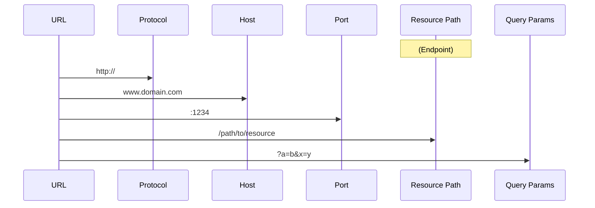

+++
title = 'Routing'

time = 30
[objectives]
    1='Identify the endpoint in a URL'
    2='Define two endpoints in Express'
[build]
  render = 'never'
  list = 'local'
  publishResources = false

+++

At the moment our server only does one thing. When it receives a request from the `/` endpoint, it sends back the same response: "Yay Node!".


Try typing http://localhost:3000/node and see what happens.


However by making use of endpoints, we can make the server send different responses for different requests. This concept is called **routing**.

#### What is an endpoint?

An endpoint is the part of the URL which comes after `/`. For example: `/chocolate` is the "chocolate" endpoint. It's the URL to which you send a request. It's the end point of the resource path.

#### What is a URL?



#### Create your own endpoints and send different responses

We're going to try sending different responses at different endpoints. Remember the `app.get()` method? To set up routing in your server, we need to repeat this method with different endpoints.

For example:

```js
app.get("/", function (req, res) {
  res.send("Hello World!");
});

app.get("/chocolate", function (req, res) {
  res.send("Mm chocolate :O");
});
```



Add some code so that your server sends one message when the endpoint is `/node` and another one when it's `/codeyourfuture`.


