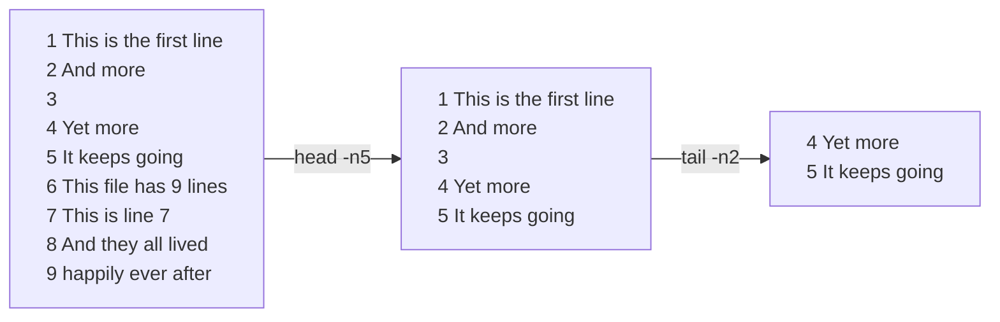

+++
title = "head and tail"
time = 20
objectives = [
  "Output the first 5 lines of a file using `head`.",
  "Output the last 5 lines of a file using `tail`.",
  "Output the five lines starting 10 lines into a file using `head` and `tail`.",
]
[build]
  list = "local"
  publishResources = false
  render = "never"
+++

`head` outputs lines (or bytes) from the start of a file. `tail` outputs lines (or bytes) from the end of a fail.

(Source, including text-only transcript: https://wizardzines.com/comics/head-tail/)

Learn about `head` and `tail` from their man pages (and the backlog exercises).

Imagine we have an input file which has 100 lines.



{{<multiple-choice
   delimiter="~"
   question="What command/pipeline could we write to skip the first three lines of the file, and then output the next 2 lines?"
   answers="`head -n3 input | tail -n2` ~ `tail -n+4 | head -n2` ~ `tail -n+3 | head -n2`"
   feedback="No - remember each stage in a pipeline applies to the output of the previous stage, not the original file. ~ Right - tail skips the first few lines, then head takes just a few from the top of that output. ~ Not quite - how many lines does this skip?"
   correct="1" >}}
