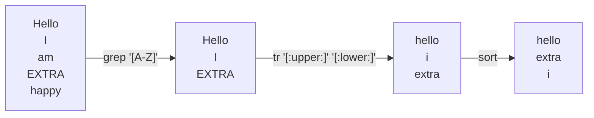

+++
title = "Shell pipelines"
time = 30
objectives = [
  "Describe what a shell pipeline is.",
  "Explain why we use shell pipelines.",
  "Explain the difference between stdout and stderr.",
  "Explain what gets passed between two programs when they're combined with a `|`.",
]
[build]
  list = "local"
  publishResources = false
  render = "never"
+++

Read the learning objectives listed on this page: Bear in mind what you’re trying to achieve while reading this text. If a topic isn’t making much sense, and isn’t in the objectives, you can probably skip over it. If a topic is listed in the objectives, you should keep studying it until you are confident you’ve met the objective.


Read [Thinking in Pipelines from Effective Shell](https://effective-shell.com/part-2-core-skills/thinking-in-pipelines/).


### Key take-aways:
* Most programs take some input, and produce some output.
* Instead of writing one program to do exactly what we want, we can often combine existing programs.
* Programs read from stdin, and write to stdout and stderr.
  * They write their main output to stdout.
  * They write error messages, progress messages, and other information that isn't their main output to stderr.
* We can pass information between programs using a pipe: `|`
* We can write the output of programs to a file using `>`, or append to a file using `>>`.

### Comparison with JavaScript

A shell pipeline is like a chain of function calls.

In JavaScript we joined together pipeline stages (functions) with `.`s:

```js
["Hello", "I", "am", "EXTRA", "happy"]
    .filter((word) => /[A-Z]/.test(word))
    .map((word) => word.toLowerCase())
    .sort()
```

In shell we join together pipeline stages (commands) with `|`s:

```bash
printf "Hello\nI\nam\nEXTRA\nhappy\n" | grep '[A-Z]' | tr '[:upper:]' '[:lower:]' | sort
```





{{<multiple-choice
   delimiter="~"
   question="If the working directory contains the files: 'primates', 'fish', and 'monotremes', what will `ls | sort | grep i | wc -l` output?"
   answers="fish primates monotremes ~ 2 ~ fish primates ~ 3"
   feedback="Not quite - `ls | sort` would output this, but there are more commands in the pipeline. ~ Right! We list three files, sort them, search for ones that contain an i (fish and primates), then count the number of output lines (one per file). ~ Not quite - `ls | sort | grep i` would output this, but there's one more command in the pipeline. ~ Not quite - check what the grep command in the pipeline does."
   correct="1" >}}

Next we will learn about some programs commonly used in pipelines.
