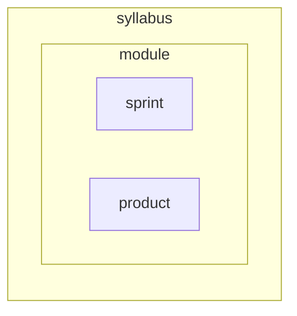

+++
title="Custom Front Matter"
description="Custom metadata that has special powers in the common theme."
emoji="🧙"
menu=["theme"]
+++

## Blocks

```toml
[[blocks]]
name="Block name"
src="path/to/block"
```

See the [blocks documentation](/common-theme/block-types) for more information.

## Backlog

```toml
backlog="Module-Name"
backlog_filter="Week 1"
```

Only active on the [Backlog view](/common-theme/pages/backlog). This will show a list of all the issues in the backlog repo for the module. You can filter by any label that exists in the backlog repo.

## Emoji

```toml
emoji = "🎽"
```

This is the emoji that will show up in the menu and on the page. It's a nice touch to help people quickly identify what they're looking at. We use emojis all the time on our Slack and it's part of our culture.

## Menus

We mostly use [Hugo menus](https://gohugo.io/content-management/menus/). Assign your modules to menus to group them by theme or purpose.

Any section assigned to `syllabus` will show in the main slideout menu. This is currently hardcoded to `syllabus` but it's simple to change this to a variable set in `hugo.toml` and we probably will at some point. You can assign a section to multiple menus.

```toml
menu = ["syllabus", "layouts"]
```

#### Menu level



Hugo doesn't like repeated names in Menus, but we want all our modules and sprints to have consistent, repeated (predictable) names. So we use the `menu_level` parameter in the front matter to assign directories to a menu _level_ based on where it is nested.

```toml
menu_level = "module"
```

Values: `module`, `sprint`, `product`
<--->





### Map

A map is an ordered slice of menus. It's to show a "map" view of the syllabus, broken down into grouped modules. As with everything in this design, the point is to clarify what happens and in what order.

It's just for the index page, and the front matter is

```toml
map = ["menuName", "menuName"]
```

## Objectives

```toml
objectives = ["objective1", "objective2"]
```

This is a list of learning objectives for a block. They will show up in the success view for any sprint this block is added to.

## Register

```toml
noRegister=true
```

This will hide the register form from the top of the day plan if you don't want it.

## Theme

```toml
theme = ["Asynchronous programming"]
```

These are assigned on prep views to build an overview page /overview. This isn't currently a Hugo taxonomy, but it could be. We might change this to a Hugo taxonomy at some point.

## Time

```toml
time = 60
```

This is the time in minutes that a block will take. It's used in the day plan to build a schedule, and in the prep view to help learners schedule their learning. Time is very important to our learners, as many people are fitting learning around other commitments, including multiple jobs, childcare, and other responsibilities. If we are asking someone to do an activity, we must be clear about how long it will take, so they can find that time.
